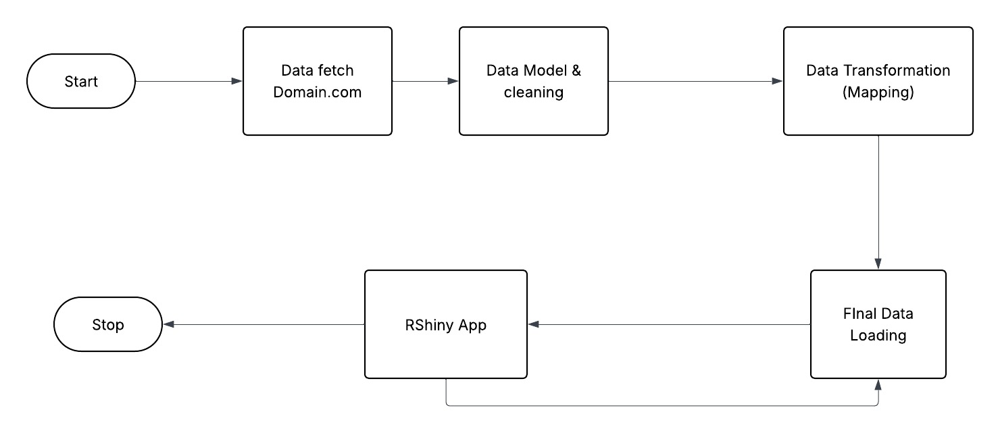
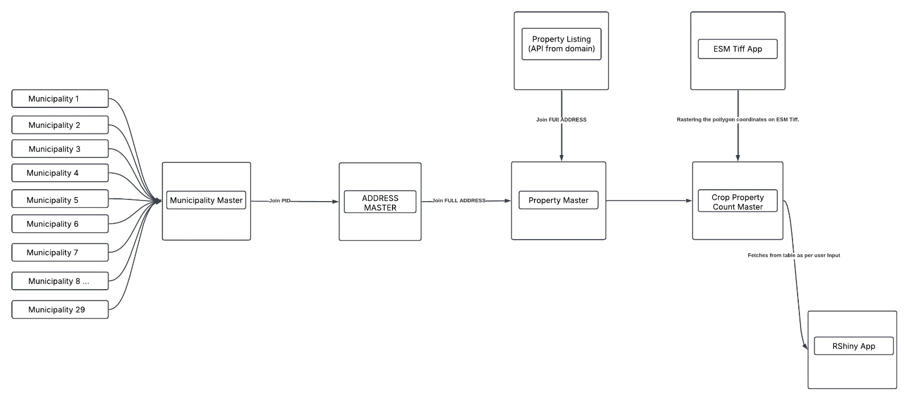
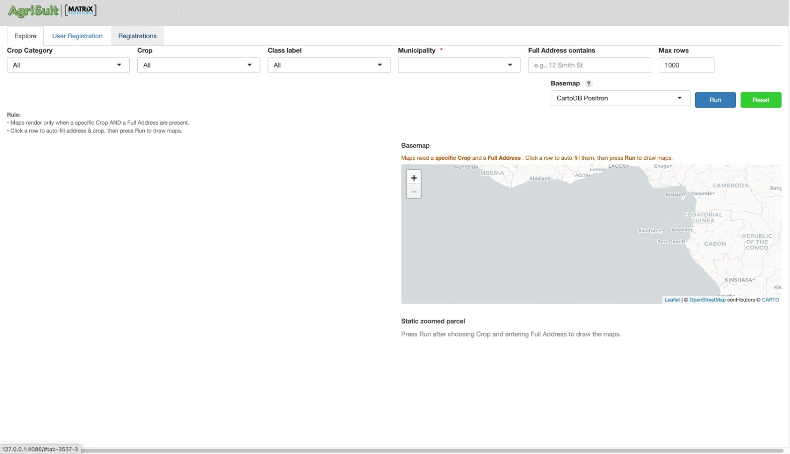
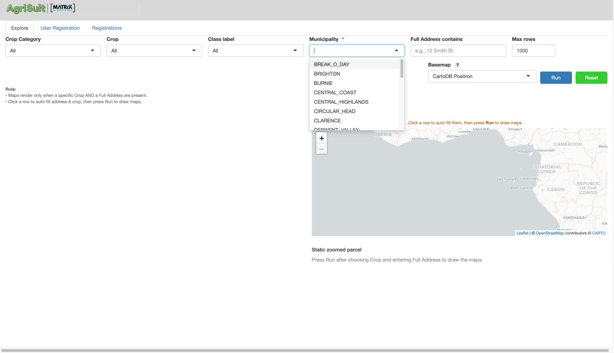
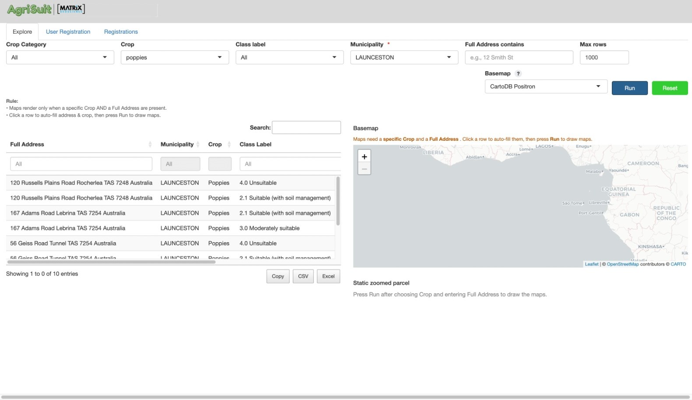
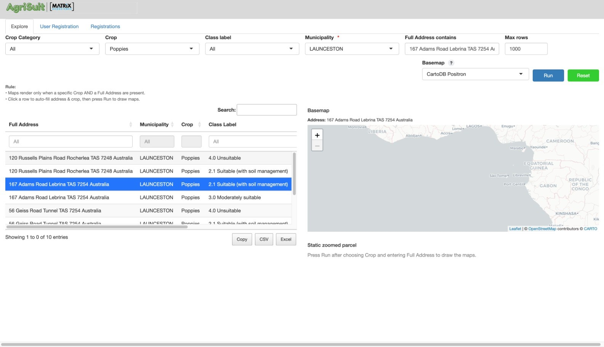
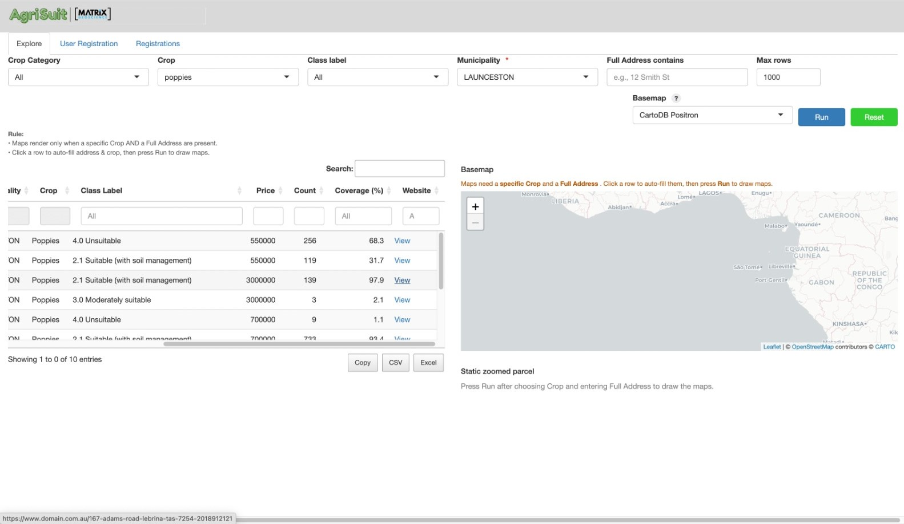
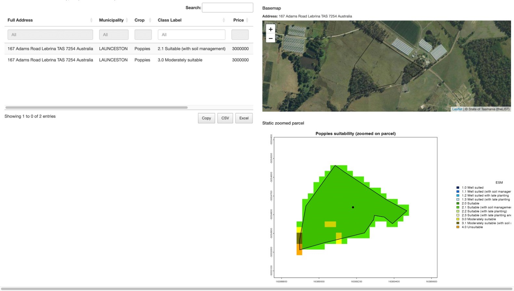
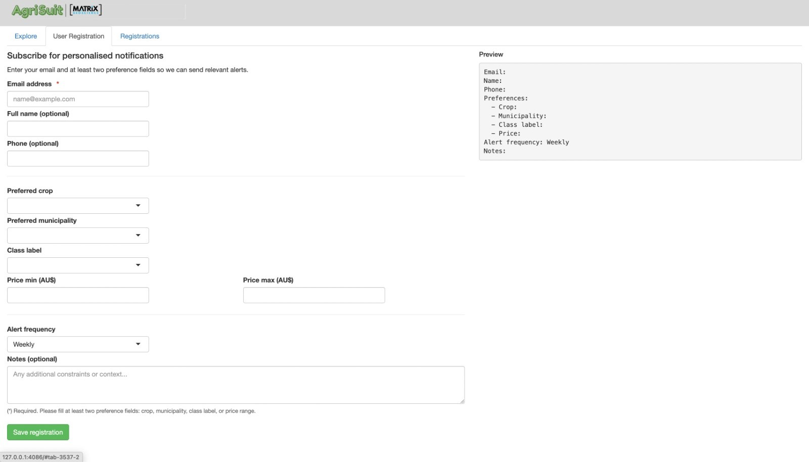

```{r setup, include=FALSE}
knitr::opts_chunk$set(echo = FALSE, message = FALSE, warning = FALSE)
```

# Abstract

This study presents AgriSuit, a prototype decision aid that links state-scale crop-suitability mapping with real-estate listings to support parcel-level screening for agricultural investment. The platform ingests official rule-based suitability layers, applies a most-limiting-factor aggregator at the pixel scale, and summarises parcels by dominant class with limiting-factor diagnostics. An interactive web interface overlays parcels with suitability evidence and provides direct link-outs to listing pages to streamline due-diligence actions. In pilot use, the approach delivers transparent, auditable outputs accessible to non-GIS users while revealing important caveats: deterministic classifications without uncertainty propagation, threshold sensitivity, aggregation bias, fixed crop catalogues, and time-windowed climate inputs. A forward roadmap prioritises scenario toggles for future climates, compact uncertainty summaries reported alongside official classes, incorporation of water-access and economic indicators to assess viability, and templated integration for additional jurisdictions.

# Introduction and Motivation

The Tasmanian Enterprise Suitability Map (TESM) is a geospatial decision-support tool that integrates soil, climate, and landscape data to classify land as well suited, suitable, marginally suitable, or unsuitable for a range of agricultural enterprises. Developed by the Tasmanian Institute of Agriculture (TIA) in collaboration with industry, TESM supports planning and investment by providing sciencebased assessments of crop potential across Tasmania. By making suitability information publicly accessible through LISTmap, it has become a cornerstone of agricultural planning and resource allocation in the state.

Despite its strengths, existing platforms present two key limitations. First, they respond poorly to changes in agribusiness trends, including the emergence of new crops that may become economically viable or strategically important for food security in the near future. Second, they are not directly linked with the property market, leaving a critical gap between geospatial crop suitability analysis
and the practical realities of land acquisition. Prospective buyers or agribusiness investors seeking to identify land parcels that align with their crop preferences must manually consult multiple sources, including property listing sites, agronomy reports, and local council data. This process is time-consuming, fragmented, and often discourages comprehensive due diligence.

Prospective buyers and landholders in Tasmania therefore lack an efficient mechanism to assess which crops are suitable for newly listed properties at the time they appear on the market. Current real-estate platforms do not integrate geospatial factors such as soils, climate, topography, or water access into actionable summaries, meaning that opportunities are frequently missed. This project addresses that gap by automatically assessing crop suitability for new property sales listings and directly linking users with properties that match their preferred crops. To achieve this, the project develops an integrated system that combines property listing information, cadastral parcel boundaries, and statewide crop suitability layers. This system computes parcel-level suitability and presents the results through an interactive Shiny dashboard, providing users with a more personalised and efficient way to evaluate investment opportunities.

Building on this problem statement, the present study redefines the role of TESM by moving beyond the static functions of LISTmap. The project develops an integrated system that links live property sales data with crop suitability assessments derived from TESM, providing users with a more personalised and efficient way to identify land that matches their preferred crops. By combining property listing
information, cadastral parcel boundaries, and statewide crop suitability layers, the system computes parcel-level suitability and delivers a more dynamic and actionable decision-support tool.

The significance of this research extends across several domains. For investors, the system enables better decision-making by reducing business risk and enhancing opportunity discovery. It assists those who already have specific crop strategies by identifying parcels that match their requirements as soon as they are listed, while also supporting landholders or capital investors who wish to explore which
crops are most suitable for a given parcel. For the agribusiness sector, it provides a scalable framework for integrating suitability analysis into real-time land acquisition decisions, enabling faster and more confident responses in an environment of rising land values, shifting crop demands, and climate uncertainty. By reducing the risk of costly misallocation, the system ensures that capital and resources are directed toward opportunities with the greatest long-term viability. For policy and planning bodies, the system demonstrates how public geospatial resources such as TESM can be re-purposed into practical, user-focused applications that bridge information gaps between government datasets and private-sector decision-making. It also highlights that these resources are not confined to a
small niche of agricultural specialists, but can deliver value to mainstream business communities, including property-based investors and developers. This broader relevance strengthens the case for continued improvement of TESM and LISTmap through the inclusion of additional variables and more sophisticated modelling approaches. By connecting suitability assessment with property market
dynamics, this project contributes to the creation of a more responsive, transparent, and data-driven agricultural investment environment in Tasmania.


\newpage

# Objective

This project aims to integrate TESM crop suitability layers with live property listing data in order to generate parcel-level suitability assessments. Building on this foundation, it develops an interactive Shiny dashboard that allows users to view ranked property recommendations, examine limiting factors, and directly access the corresponding property listings. The project also evaluates the tool’s functionality through case studies in Tasmania and explores its potential for broader application, extending to regions with comparable suitability datasets and to future industry-facing implementations.

\newpage

# Literature Review

## Rationale for Selecting Tasmania as AgriSuit Pilot Region

Tasmania was chosen as the starting point for AgriSuit because it offers the right mix of economic importance, data quality, and regional focus needed to demonstrate the model’s potential. Agriculture plays a much larger role in Tasmania’s economy than in most Australian states, contributing around 10 percent of the state’s GDP. This makes it an ideal location to test how data-driven decision tools can strengthen agricultural productivity and sustainability while supporting regional planning.

A key advantage of working in Tasmania is the availability of the Tasmanian Enterprise Suitability Model (TESM). Unlike broader systems such as [FAO Agro-MAPS](https://gaez.fao.org/pages/agromaps) or Queensland’s Land Suitability Guidelines, TESM provides fine-resolution spatial mapping, which is 80 meter square. This allows crop suitability to be assessed at both farm and regional scales, enabling more precise and meaningful recommendations. TESM’s rule-based approach, which applies the “most limiting factor” principle, fits perfectly with AgriSuit’s design, making it easy to integrate into the system’s logic and extend for new crops or conditions.

Tasmania also stands out for its open access to high-quality spatial data. The LIST (Land Information System Tasmania) [Open Data Portal](https://listdata.thelist.tas.gov.au/opendata/) provides free, well-structured datasets on soil, climate, topography, and crop attributes. This open infrastructure supports transparent, reproducible analysis and encourages innovation in spatial modelling.

Altogether, Tasmania offers a unique combination of economic relevance, technical depth, and data openness. Its strong agricultural base and advanced modelling framework make it the most suitable region to pilot AgriSuit and demonstrate how localized, high-resolution mapping can transform land-use and crop planning decisions.


## The Tasmanian Enterprise Suitability Map (TESM)

The [Tasmanian Enterprise Suitability Map (TESM)](https://nre.tas.gov.au/agriculture/investing-in-irrigation/enterprise-suitability-toolkit/enterprise-suitability-maps) represents a mature, data-driven framework for assessing agricultural potential across Tasmania. Originating from the [Wealth from Water](https://www.flinders.tas.gov.au/client-assets/images/Council/Downloads/Agendas/2015.02/Annex%206.%20Item%20A1%20Wealth%20from%20Water%20Brochure.pdf) program initiated in 2010 by the Tasmanian Department of Primary Industries, Parks, Water and Environment, which has since been restructured and renamed as the Department of Natural Resources and Environment Tasmania [(NRE Tas)](https://nre.tas.gov.au/) in collaboration with the Tasmanian Institute of Agriculture (TIA) and the University of Sydney, TESM sought to provide an objective, reproducible, and spatially explicit basis for agricultural development planning. The program was itself a direct response to the Innovation Strategy (2009) led by Jonathan West, which identified irrigation expansion as a transformative opportunity for Tasmania’s regional economy. The pilot phase initially covered about 70,000 hectares in the Meander Valley and Midlands, subsequently expanding to state-wide coverage through initiatives such as [Water for Profit](https://www.utas.edu.au/__data/assets/pdf_file/0008/1092068/TIA-Water-for-Profit-Brochure-2.pdf). In this progression, the emphasis shifted from qualitative soil surveys to Digital Soil Mapping (DSM) and Digital Soil Assessment (DSA) techniques that operationalised soil and climate data into decision-support tools for land managers and investors (Kidd, 2020).

TESM’s analytical foundation rests upon the integration of three primary data domains, consisting of soil, climate, and topography. The domains are processed through quantitative spatial modelling. The soil component draws on more than 900 core samples describing attributes such as pH, clay content, drainage class, and stone content (Kidd & Webb, 2015). [Climate inputs](https://nrmdatalibrary.nre.tas.gov.au/FactSheets/WfW/ListMapUserNotes/Inventory_DCM_Tas.pdf) originate from a network of over 270 temperature sensors distributed across representative terrain positions, enabling fine-scale modelling of variables such as frost risk, chill hours, growing-degree days, and extreme heat frequency. Topographic variables, derived from Shuttle Radar Topography Mission (SRTM) data, gamma-radiometric imagery, and surface geology, capture slope, aspect, and elevation effects. These heterogeneous datasets are standardised and co-registered, then resampled at 80 m and modelled using regression-tree and regression-kriging approaches to produce spatially continuous soil-attribute predictions with validation accuracy appropriate for regional-scale land evaluation (Kidd & Webb, 2015). The result is a three-dimensional digital representation of the Tasmanian soil landscape that supports downstream suitability analyses.

The suitability evaluation itself employs a deterministic, rule-based framework derived from the Food and Agriculture Organization (FAO, 1976) land-evaluation system and refined through the “most-limiting-factor” principle articulated by Klingebiel and Montgomery. Each crop or enterprise is governed by a rule set developed jointly by TIA researchers and industry experts, defining optimal and limiting parameter thresholds across the soil–climate–topography continuum. The model classifies each grid cell into four main hierarchical categories, i.e. _well suited_ , _suitable_ , _marginally suitable_ , _unsuitable_ based on the lowest-rated criterion. Thus, if drainage or frost risk is poor even when all other factors are optimal, the overall classification defaults to “unsuitable.” This conservative logic enhances interpretability and ensures that biophysical limitations are not overlooked in investment decisions. The framework also differentiates between _manageable_ and _unmanageable_ constraints, acknowledging that interventions such as liming or artificial drainage can upgrade a site’s effective suitability (Kidd et al., 2015).

Following early operational success, the project advanced to produce state-wide 3D soil-attribute maps at high resolution, which were integrated into the national [Terrestrial Ecosystem Research Network (TERN)](https://www.tern.org.au/) and [GlobalSoilMap.net](https://isric.org/projects/globalsoilmapnet) repositories (Kidd & Webb, 2015). Complementary climatic projections from [Climate Futures for Tasmania](https://climatefutures.org.au/climate-futures-for-tasmania/) were incorporated to generate suitability layers for 2030 and 2050 under [Representative Concentration Pathway (RCP) 8.5 scenarios](https://www.climatechangeinaustralia.gov.au/en/changing-climate/future-climate-scenarios/greenhouse-gas-scenarios/). Each enterprise is therefore represented by three temporal surfaces of current (2018), near-future (2030), and long-term (2050), enabling preliminary adaptation planning. An aggregated [Enterprise Versatility Index (EVI)](https://www.thelist.tas.gov.au/app/content/data/geo-meta-data-record?detailRecordUID=d56c5151-9eef-49aa-9712-4f700d65547e) summarises the number of viable enterprises/crops per grid cell, thereby identifying land parcels capable of diversified production. The integration of these high-resolution soil and climate grids has substantially improved Tasmania’s ability to visualise spatial heterogeneity in agricultural potential.

The Tasmanian wine sector provides a salient example of TESM’s applied relevance. Building on earlier climate modelling (Webb et al., 2015, 2018), the Enterprise suitability mapping and Tasmania’s wine sector (Brullo et.al, 2024) demonstrates how TESM outputs guide site selection for viticulture by combining frost-risk surfaces, growing-degree-day thresholds, and soil-drainage indices. These analyses have supported Tasmania’s transition toward high-value sparkling and cool-climate table wines, where irrigation expansion and land-use zoning are strategically coordinated with biophysical suitability. TESM data are increasingly used by policy agencies to outline priority irrigation districts and agricultural investment zones, reinforcing its dual role as a scientific and economic planning instrument.


\newpage

```{r, warning=F, message=F}
library(tidyverse)

crops_all <- readRDS("dataset/all_crops_df.rds")

```

```{r}
library(kableExtra)

crops_list <- crops_all |> 
  distinct(`Crop Type`)
```

```{r}
crops_types <- crops_list |>
  mutate(
    Type = case_when(
      # pastures
      str_detect(`Crop Type`, 
                 regex("clover|ryegrass|fescue|phalaris|lucerne|cocksfoot", 
                       ignore_case = TRUE)) ~ "pastures",
      # perennial horticulture (fruit, nuts and wine grapes)
      str_detect(`Crop Type`, 
                 regex("blueberries|cherries|hazelnuts|olives|raspberries|strawberries|tablewg|sparklingwg", 
                       ignore_case = TRUE)) ~ "perennial horticulture",
      # vegetables
      `Crop Type` %in% c("carrots", "carrotseed", "onions", "potatoes") ~ "vegetables",

      # cereals / oilseeds
      `Crop Type` %in% c("barley", "wheat", "linseed") ~ "cereals",

      # pharmaceuticals
      `Crop Type` %in% c("hemp", "poppies", "pyrethrum") ~ "pharmaceuticals",

      # forestry
      str_detect(`Crop Type`, 
                 regex("tree", ignore_case = TRUE)) ~ "forestry",
      TRUE ~ "unclassified"
    )
  )
```

```{r}
#| label: tbl-cropcommodity
#| tbl-cap: "List of All Current Crops in TESM"

grouped_tbl <- crops_types |>
  group_by(Type) |>
  summarise(
    `Crops` = paste(sort(unique(`Crop Type`)), collapse = ", "),
    .groups = "drop"
  ) |>
  # (optional) order the rows the way you want
  mutate(Type = factor(
    Type,
    levels = c("cereals","perennial horticulture","vegetables",
               "pharmaceuticals","pastures","forestry","unclassified")
  )) |>
  arrange(Type)

kable(grouped_tbl) |>
  kable_styling(full_width = FALSE) |>
  column_spec(2, width = "10cm")

```


As shown in @tbl-cropcommodity, TESM catalogue comprises 33 crops grouped into seven major commodity classes. Given Tasmania’s comparatively limited arable extent, fragmented parcel structure, and frost-prone microclimates, crop choices must emphasise tolerance to wider climatic variability (e.g., frost and cool-season conditions) and the ability to sustain viable yields at smaller spatial scales than are typical on mainland Australia. Consequently, suitability assessments and investment screening prioritise climate-resilient cultivars, management flexibility (e.g., irrigation/readiness for frost mitigation), and systems that maintain productivity under tighter land and environmental constraints.

Despite its technical sophistication, the Tasmanian Enterprise Suitability Model (TESM) has several recognised limitations. Its spatial accuracy depends on data density, declining in sparsely surveyed regions. The assumption of universal irrigation can overestimate suitability in dryland areas, and deterministic thresholds do not account for uncertainty, making results sensitive to small input changes. TESM also provides a static snapshot rather than a dynamic forecasting tool, and the administrative process for adding new crops limits responsiveness to emerging industries.

Nevertheless, TESM remains a significant contribution to digital soil assessment in Tasmania. It represents one of Australia’s most comprehensive applications of digital soil modelling, integrating DSM, rule-based evaluation, and climate projections to support evidence-based agricultural planning. While its fixed thresholds and irrigation assumptions highlight the need for more flexible and uncertainty-aware systems, TESM continues to serve as a robust first-pass planning tool that translates complex soil–climate data into practical, interpretable suitability information.


## Approaches to Crop Suitability Mapping

Crop-suitability frameworks vary widely across regions in data quality, model design, and agronomic priorities. For this project, linking suitability models with property listings to inform land-use investment is to understand how alternative approaches affect comparability, interpretability, and system integration. Tasmania’s TESM provides a deterministic, rule-based baseline; other systems adopt probabilistic or hybrid methods that quantify uncertainty and simulate climate responses. Comparing these approaches shows that the concept of coupling suitability with market data is globally transferable, but implementation depends on each system’s data structures, class vocabularies, and decision logic (Malone & Kidd, 2015).

```{r}
crops_inputs <- crops_all |>
  pivot_longer(
    cols = -Crop_Type,    
    names_to = "Variable",  
    values_to = "Value"       
  ) |>
  select(Variable) |>     
  distinct()             

vars_clean <- crops_inputs |>
  mutate(Variable = str_squish(Variable)) |>
  filter(
    Variable != "",
    !str_detect(Variable, "^\\d+$"),
    Variable != "Rating",
    !str_detect(Variable, "^(\\.{3,}|…)\\d+$")
  ) |>
  filter(!str_detect(Variable, "^Aspect\\b")) |>
  # strip trailing explanatory text:
  #  - from " (" to end
  #  - from " C..." to end
  #  - from " <digit>..." to end
  mutate(
    Variable = Variable |>
      str_replace(" \\(.*$", "") |>
      str_replace(" C.*$", "") |>
      str_replace(" [0-9].*$", "") |>
      str_squish()
  ) |>
  filter(!str_detect(Variable, "^[\\.…\\s\\d]+$")) |>
  # family standardisation (keep original casing by default)
  mutate(var_lc = str_to_lower(Variable)) |>
  mutate(
    Variable_std = case_when(
      str_detect(var_lc, "frost")                     ~ "Frost risk",
      str_detect(var_lc, "rainfall|\\brain\\b")       ~ "Rainfall",
      str_detect(var_lc, "stone")                     ~ "Stone abundance",
      str_detect(var_lc, "chill\\s*hours?")           ~ "Chill hours",
      str_detect(var_lc, "daily maximum temperature") ~ "Daily maximum temperature",
      str_detect(var_lc, "electrical conductivity|\\becse\\b|\\bd?s/m\\b")
                                                                   ~ "Electrical conductivity",
      str_detect(var_lc, "extreme heat risk")                       ~ "Extreme heat risk",
      str_detect(var_lc, "\\bheat( at harvest| stress)?\\b")        ~ "Heat stress",
      str_detect(var_lc, "air temperature|mean maximum monthly (air )?temperature")
                                                                   ~ "Air temperature",
      TRUE                                                          ~ Variable
    )
  ) |>
  mutate(
    Variable_std = str_replace_all(Variable_std, "\\bPh\\b", "pH")
  ) |>
  distinct(Variable_std) |>
  arrange(Variable_std) |>
  rename(Variable = Variable_std) |>
  select(Variable)

```

```{r}
vars_classified <- vars_clean |>
  mutate(var_lc = str_to_lower(Variable)) |>
  mutate(Class = case_when(
    # Climate 
    str_detect(var_lc, "\\bair temperature\\b") ~ "climate",
    str_detect(var_lc, "chill\\s*hours?") ~ "climate",
    str_detect(var_lc, "daily maximum temperature") ~ "climate",
    str_detect(var_lc, "extreme heat risk") ~ "climate",
    str_detect(var_lc, "frost risk|frost\\b") ~ "climate",
    str_detect(var_lc, "\\bgrowing degree days\\b|\\bgdd\\b") ~ "climate",
    str_detect(var_lc, "growing season temperature") ~ "climate",
    str_detect(var_lc, "hot weather during summer") ~ "climate",
    str_detect(var_lc, "\\brainfall\\b") ~ "climate",
    str_detect(var_lc, "\\bheat stress\\b") ~ "climate",

    # Topography 
    str_detect(var_lc, "\\bslope\\b") ~ "topography",
    str_detect(var_lc, "\\belevation\\b") ~ "topography",
    str_detect(var_lc, "\\baspect\\b") ~ "topography",  
    
    # Soil attributes
    str_detect(var_lc, "\\bsoil depth\\b|\\bsoil\\s*depth\\b|^soil depth$") ~ "soil",
    str_detect(var_lc, "\\bsoil depth\\b|\\bsoil depth\\b") ~ "soil",
    str_detect(var_lc, "soil drainage") ~ "soil",
    str_detect(var_lc, "soil texture|duplex soil") ~ "soil",
    str_detect(var_lc, "electrical conductivity|\\becse\\b|d?s/m") ~ "soil",
    str_detect(var_lc, "\\bpH\\b") ~ "soil",
    str_detect(var_lc, "stone abundance") ~ "soil",
    str_detect(var_lc, "depth to sodic layer") ~ "soil",
    str_detect(var_lc, "exchangeable calcium|exchangeable magnesium") ~ "soil",
    TRUE ~ "other"
  )) |>
  filter(Variable != "Crop Type") |>
  select(Variable, Class)

```

```{r}
#| label: tbl-allvariables
#| tbl-cap: "List of All Variables in TESM"

vars_tbl <- vars_classified |>
  filter(Class %in% c("soil", "climate", "topography")) |>
  mutate(Class = recode(Class, "soil" = "soil attribute")) |>
  group_by(Class) |>
  summarise(Variables = paste(sort(unique(Variable)), collapse = ", "),
            .groups = "drop") |>
  arrange(Class)
  
kable(vars_tbl, booktabs = TRUE, col.names = c("Class", "Variables")) |>
  kable_styling(full_width = FALSE) |>
  column_spec(2, width = "13cm") 

```

DIsplayed in @tbl-allvariables containing variables encoded for soil, climate, and terrain, with a Most-Limiting-Factor aggregator to assign pixel classes. Strengths are transparency, auditability, and direct traceability from factor thresholds to parcel-level outcomes. Constraints include boundary brittleness near cut-offs, non-compensation among factors, and dependence on official class schemes and legends. For integration with listings, deterministic maps are straightforward to explain to non-specialists, but require careful legend normalisation across crops and explicit notes on native resolution and epochs.

Probabilistic and fuzzy extensions (e.g., Malone & Kidd-style uncertainty). These quantify class likelihoods or membership grades and can propagate input uncertainty, reducing edge effects and supporting risk-aware screening. They improve decision confidence but introduce additional layers (probabilities, intervals) that must be summarised coherently for property workflows. Integration benefits from storing both the baseline categorical class and a compact uncertainty statistic (e.g., confidence band or top-two class probabilities) at parcel scale.

Hybrid and modular systems. Phenology-aware or scenario-rich designs (e.g., New Zealand implementations that combine frost risk with bud-break timing) mitigate single-indicator brittleness and make climate sensitivity explicit. Global frameworks (e.g., FAO GAEZ) extend scope to yield and yield-gap analyses with scenario pathways, trading local detail for coverage and comparability. For real-estate linkage, hybrids are attractive because they expose both current classification and scenario response, but they demand clear schema bridges (class labels, epochs, units) and careful downscaling when parcel-level decisions are required.

Implications for linking suitability with property markets.

Comparability: Class schemes, colour palettes, and granularity differ across crops and systems; cross-crop and cross-region comparisons require legend harmonisation and explicit metadata.

Resolution and epochs: Native grid size and climate windows must be surfaced to avoid over-precision at parcel boundaries and to enable like-for-like comparisons over time (e.g., present vs 2030/2050).

Uncertainty communication: Where probabilistic outputs exist, parcel-level summaries should report both the categorical class and a compact confidence indicator.

Licensing and custodianship: Data access, update cadence, and the ability to add crops or modify rules are governed by custodians; portability to new jurisdictions requires new rule packs and validation with local experts.

Workflow integration: Suitability layers must align with listing attributes (location, area filters, water access) and cadastral geometries to support due-diligence tasks without GIS expertise.

Conclusion and transition. In summary, deterministic, probabilistic, and hybrid frameworks each offer distinct trade-offs in interpretability, risk communication, and scalability. The underlying idea—integrating suitability evidence with property listings to support investment decisions—is broadly applicable, but delivering it in practice requires custom schema mapping, legend normalisation, and jurisdiction-specific rule packs. The next section turns to GIS-enabled Spatial Decision Support Systems (SDSS), showing how interactive platforms operationalise these requirements through reproducible overlays, parcel-level summaries, and scenario/uncertainty toggles appropriate for end-user workflows.

## Geographic Information Systems (GIS) and Spatial Decision Support

Geographic Information Systems (GIS) underpin the analytical foundation of this project by enabling the integration and visualization of diverse spatial data, environmental suitability layers from the Tasmanian Enterprise Suitability Model (TESM) and property attributes from real-estate listings within a unified decision environment. In the context of this study, GIS functions not as a broad mapping tool but as a decision-support mechanism, linking agronomic intelligence with market accessibility to inform sustainable agricultural investment.

Spatial Decision Support Systems [(SDSS)](https://atlas.co/glossary/spatial-decision-support-systems/) extend traditional GIS capabilities by embedding rule-based and multi-criteria evaluation (MCE) models within interactive interfaces. As Carver (2015) noted, the evolution from stand-alone GIS models to participatory, web-based SDSS frameworks enhanced transparency and stakeholder engagement in spatial planning. This same paradigm underpins the present project’s design, operationalising TESM data through a web-based dashboard that allows distributed users (e.g., farmers, investors, and policymakers) to explore suitability and property information simultaneously.

The selection of a Shiny based GIS interface reflects both technical and strategic considerations. Shiny provides an open source, interoperable, and reproducible environment within the R ecosystem, where the TESM datasets, statistical models, and spatial processing workflows already reside. This ensures seamless integration with R packages such as sf, terra, and leaflet, supporting dynamic map rendering, spatial querying, and user driven filtering without external proprietary dependencies. Shiny’s reactive programming structure also enables real time interaction between crop suitability layers and property attributes, allowing users to apply filters (e.g., crop type and municipality) and instantly visualise relevant parcels and listings.

Open source precedents such as [Pi-VAT](https://github.com/devalc/Pi-VAT) (Deval et al., 2022) and ExActR (Gibbons et al., 2025) demonstrate that R based, web-enabled GIS systems can effectively translate complex environmental models into accessible decision dashboards. However, the current project extends these applications beyond environmental management to the agri-real-estate domain—embedding suitability intelligence (AgriSuit) directly within property search and investment decision workflows. By operationalising TESM data through Shiny, the system transforms GIS from a back-end analytical process into a front-end, interactive decision interface, aligning with the project’s objective of bridging agronomic insight and market opportunity within a transparent, web accessible platform.


## Data Storage Approach

The current AgriSuit model built persists processed datasets and analytical outputs in DuckDB, an embedded, columnar SQL engine running inside R. This configuration minimises setup overhead, supports rapid iteration with R Shiny, and retains reproducibility by saving the complete database to a single file under version control.

DuckDB has performance speed that suitable for exploratory development and demonstrations, since it provides low-latency analytical queries (e.g., parcel-level pixel aggregations, filterable property views) and seamless input/output with CSV, enabling simple, scriptable data exchange across pipeline stages.

Constraints of the prototype. DuckDB is not optimised for concurrent multi-user access, role-based security, or high availability. As usage scales, risks emerge around contention, access control, backup/restore guarantees, and operational observability. A production instance should migrate to a stand-alone database server or managed cloud service.


## Real-Estate Listing Platforms and Agricultural Land Information 

An audit of mainstream property platforms in Australia (e.g., Domain, RealEstate.com.au) and rural-focused sites (e.g., Farmbuy, Farmproperty) shows a consistent emphasis on transactional features such as parcel size, tenure, and local amenity (See _Appendix 1_). These listings rarely expose verified biophysical data, soil chemistry, drainage class, frost metrics, or slope, nor do they provide transparent suitability logic. When “suitable crops” are mentioned, such claims are typically seller-supplied and lack traceable links to datasets or rule-sets, forcing buyers to manually cross-reference external sources such as government soil maps or climate overlays. This fragmented process systematically disadvantages non-GIS specialists who cannot easily assemble soil, climate and topography evidence to support investment or planning decisions. The absence of verifiable biophysical layers is therefore not cosmetic. it fundamentally undermines what “suitability” means in agricultural decision-making.

Existing literature and planning frameworks confirm that this fragmentation is systemic. Snelder et al. (2013) emphasise that land-use suitability is not an intrinsic property of a parcel but the outcome of composite indicators like soil, terrain, climate, management, and environmental objectives, weighted according to regional priorities. Without transparency in these indicators or access to underlying data, any claim of “crop suitability” remains contestable. Similarly, governance materials such as Tasmania’s Agricultural Land Mapping Project (ALMP) and the associated zoning guidelines (Tempest & Ketelaar, 2017) recognise that automated desktop models can yield anomalies and must be interpreted alongside expert review and verified datasets, including the Land Potentially Suitable for Agriculture layer and water-resource portals. These sources reinforce a shared message: sound agricultural assessment depends on integrated, multi-layer spatial evidence, not static property metadata.

In this context, AgriSuit responds to the identified gap by coupling TESM derived suitability data with real-estate listings through an interactive interface, transforming fragmented market information into an evidence-based, transparent decision environment.


## The Integration Gap

There is a clear gap between land-suitability modelling and the way property information is presented in the market. On one side, tools like the Tasmanian Enterprise Suitability Model (TESM) and Digital Soil Assessment (DSA) combine soil, climate, and terrain data into rule-based suitability maps. On the other hand, property platforms such as Domain or Farmbuy are designed mainly for transactions, focusing on listings, valuations, and amenities. The two systems operate independently. Buyers and planners can see what land is for sale but not how its physical characteristics support specific crops or land uses. At the same time, suitability maps remain locked within institutional databases, disconnected from real-time property listings.

This divide is not only technical, but also reflects how suitability is understood. Whether land is appropriate for a certain crop depends on several indicators like soil type, slope, rainfall, and management objectives, not a single label. When property listings describe land as “suitable for farming” without showing these indicators or how they are weighted, the claim is weak and unverifiable. Transparent interfaces that reveal both the logic and the uncertainty behind suitability classifications are essential for informed decisions.

Beyond technology, policy and institutional barriers also make integration difficult. Many public registries and planning systems have not yet adopted the digital standards needed to share or align spatial data easily. Different agencies manage agriculture, water, and zoning information, but these layers rarely flow into the property platforms where most investment choices are made. As a result, reliable spatial evidence often stops at the edge of the marketplace.

AgriSuit is designed to close this gap. By linking TESM derived suitability data with live property listings in a single interactive interface, it connects verified spatial intelligence with market information and demonstrates how both technical and governance barriers can be overcome in practice.


\newpage 


# Data

## Data Sources and Description

This section outlines the four datasets integrated into the AgriSuit platform; property listings from Domain.com.au, crop-specific environmental suitability maps (TESM), cadastral parcel boundaries from LISTMap, and address-point data from LISTMap. Analyses were conducted in R (version 4.3.0 or above) using `rvest`, `dplyr`, `purrr`, `sf`, `terra`, `exactextractr`, and `knitr`, `kableExtra.` The interactive prototype uses shiny and leaflet. Each dataset contributes a unique spatial or semantic dimension that collectively enables parcel-level crop-suitability analysis and property–crop linkage. @tbl-datasources summarises the provenance, file characteristics, and licensing status of each dataset.


Table: Data Descriptions {#tbl-datasources}

| Attribute             | Property Listing                                                      | TESM Crop Rules                                       | LISTMap Cadastral Parcel                                 | LISTMap Address Point                                       |
| --------------------- | --------------------------------------------------------------------- | ----------------------------------------------------- | -------------------------------------------------------- | ----------------------------------------------------------- |
| **Source**            | Domain.com.au                                                                     | LISTMap Open Data                                                     | LISTMap Open Data                                                        | LISTMap Open Data                                                           |
| **File Type**         | HTML (scraped); CSV processed                                         | GeoTIFF + .vat.dbf                                    | SHP + DBF + PRJ (+ aux files)                            | SHP + DBF (+ aux files)                                     |
| **Metric**            | 289 records (July 2025 snapshot)                                      | 30–80 m cell resolution                               | Parcel-polygon coverage (~560 k features)                | ~340 k address points statewide                             |
| **Criteria (Filter)** | Filtered for Tasmanian listings; price parsed to numeric; land area $\geq$ 10 Ha; geocoded; deduplicated by full_address. | Selected 33 crops with complete raster and .VAT files | 29 municipal folders merged; retained active PID records | Statewide dataset linked by PID and full address string     |
| **Limit- ation**        | Price inconsistency; missing coordinates for some records             | Two crops (cherries, hazelnuts) missing .VAT files    | File-type fragmentation across municipalities            | Address tokens parsed by space; requires string re-assembly |
| **Value Add**         | Market pricing and listing attributes for agri-investment analysis    | Pixel-level suitability classification per crop       | Geometric boundaries for parcel-based zonal analysis     | Spatial join bridge between address and parcel datasets     |
| **License**           | Terms of Use                                                                     | CC BY 3.0 AU                                                     | CC BY 3.0 AU                                                        | CC BY 3.0 AU                                                           |


Together, these datasets form a unified analytical base linking market listings with environmental suitability and cadastral geometry.


## Data Wrangling Process (IDA)

The initial wrangling phase standardised the property-listing dataset and prepared geospatial layers for integration. Web-scraped HTML content was parsed using `rvest` package and cleaned through regular expression logic to extract addresses and numeric prices. @tbl-rawdata shows a sample of the raw property data prior to transformation.

Table: Raw Wrangled Data Display {#tbl-rawdata}

| Full Address (raw)                            | Price_raw         |
| --------------------------------------------- | ------------------ |
| 401 Bresnehans Road, Little Swanport TAS 7190 | Offers Over $875 k |
| 111 Nubeena Road Taranna TAS 7180   | $1,295,000 |
| 120 Russells Plains Road Rocherlea TAS 7248 | $550,000 |
| 19 Central Castra Road Sprent TAS 7315 | Offers Over $875k |
| 172 Bridgenorth Road Legana TAS 7277 | Expressions Of Interest |


Geospatial components were obtained from the Tasmanian [LISTMap Open Data](https://listdata.thelist.tas.gov.au/opendata/) portal. Cadastral parcels were downloaded per municipality (29 folders), while statewide address points and cropspecific TESM rasters were retrieved as separate layers. Each file was inspected for completeness and


## Data Handling and Integration (EDA)

### Property Listing Cleaning

The cleaned property dataset retained 262 valid Tasmanian listings with geocoded latitude–longitude coordinates obtained via SQL cleaning workflows. Outliers (e.g., missing or duplicate full addresses) were removed.

A composite key full_address was created by concatenating street, suburb, state, and postcode fields.

### Cadastral Parcels

Each municipal folder contained a set of standard GIS vector components (Rogers et al, 2025), displayed on @tbl-gis:

Table: GIS Folder Components {#tbl-gis}

| Component              | Function                                      |
| ---------------------- | --------------------------------------------- |
| `.shp`                 | Stores polygon geometry (parcel boundaries)   |
| `.dbf`                 | Contains attribute table (e.g., PID, area)    |
| `.prj`                 | Defines coordinate reference system (CRS)     |
| `.shx`, `.sbn`, `.sbx` | Spatial index files for faster rendering      |
| `.gdb`, `.tab`         | Alternative formats for the same geometry set |


These files collectively represent cadastral parcels in EPSG:28355 (GDA94 / MGA Zone 55). The Parcel Identifier (PID) attribute uniquely distinct each parcel and serves as the join key linking with both the address-point dataset and TESM raster extractions. Parcel polygons provide the geometric foundation for zonal statistics such as area and pixel-count aggregation.

### Address Points

The statewide address-point dataset is stored as a shapefile containing coordinate locations and parsed address components (ST_NO_FROM, STREET, ST_TYPE, LOCALITY, STATE, POSTCODE).

@tbl-addresspoints illustrates the tokenised structure of this dataset.


Table: Address Points Tokenized Raw Data {#tbl-addresspoints}

| ST_NO_FROM | STREET     | ST_TYPE | LOCALITY        | STATE | POSTCODE |
| ---------- | ---------- | ------- | --------------- | ----- | -------- |
| 401        | Bresnehans | Road    | Little Swanport | TAS   | 7190     |
| 21         | Waterson   | Lane    | Carlton         | TAS   | 7173     |
| 172        | Bridgenorth| Road    | Legana          | TAS   | 7277     |


To align with the property-listing format, these components were concatenated into a single full_address field by the pattern ST_NO_FROM + STREET + ST_TYPE + LOCALITY + STATE + POSTCODE + "Australia". This derived string enables one-to-one matching with listing data and provides a secondary linkage to parcel polygons via PID.


### Crop TESM Layers

TESM rasters represent crop-specific environmental suitability across Tasmania. Each crop has a GeoTIFF raster (.tif) encoding suitability scores and a corresponding attribute table (.vat.dbf) defining class labels and colour schemes. Both are required: the .tif stores numeric cell values, while .vat.dbf provides the categorical legend necessary for interpretation. Crops lacking complete pairs (notably cherries and hazelnuts) were excluded from subsequent analysis.
Raster data were processed in `terra` using the `exactextractr` method to compute per-parcel suitability distributions. Each parcel was overlaid on the corresponding crop raster to extract pixel counts per class. Suitability aggregation followed the most-limiting-factor principle described in Section 6.2.


### Coordinate Alignment and Integration

Before joining datasets, all layers were re-projected to the same coordinate reference system (EPSG:28355) to ensure consistent distance and area metrics. The integration workflow comprised:

  1. Matching property listings - address points via full_address
  
  2. Linking address points - parcels via PID
  
  3. Overlaying parcels - crop TESM rasters for pixel-level aggregation

The final database contained over 100.000 rows representing all combinations of (land parcel × crop × suitability class × pixel count) for 33 crops and 7-11 class labels depending on the crops. Pre-computing this structure significantly reduced runtime during Shiny-app queries, avoiding on-the-fly pixel-count calculations. @tbl-tool shows the process and tool pairs.


Table: Process-Tool Pairs {#tbl-tool}

| Stage | Operation                       | Key Script / Tool  | Output Object   | Records / Features |
| ----- | ------------------------------- | ------------------ | --------------- | ------------------ |
| A     | Web scraping and price cleaning | rvest + regex      | `df_raw`        | 289                |
| B     | Geocoding                       | tidygeocoder (OSM) | `df_geo`        | 262                |
| C     | Parcel join                     | sf + terra         | `parcel_joined` | 262                |
| D     | TESM extraction                 | exactextractr      | `crop_parcel`   | > 100,000           |


\newpage


# Methodology

{#fig-flow width=80% fig-align="center"}


The data pipeline illustrated above @fig-flow represents a streamlined end-to-end workflow that transforms raw property listings into interactive geospatial insights. The process begins with automated data extraction from Domain.com, capturing property attributes and spatial identifiers. This raw data undergoes rigorous modelling and cleaning to ensure structural consistency and remove redundancies before being passed through a transformation stage that maps listings to cadastral parcels and crop-suitability indicators. The transformed datasets are then integrated and loaded into a consolidated DuckDB environment, forming the analytical backbone of the system. Finally, the curated data is delivered through an RShiny interface, enabling dynamic exploration, filtering, and visualisation of property-suitability relationships. Together, these stages create a cohesive data ecosystem that bridges web-sourced property data with spatial analytics, ensuring both transparency and reproducibility across the AgriSuit workflow.


## Data Pipeline

### Data Fetch (Domain.com.au and Supporting Datasets)

Referring to @fig-flow, the work begins with the data fetch stage, where multiple datasets are collected from both online and cadastral sources to build the foundation for analysis. The primary dataset is obtained from [Domain.com.au](https://www.domain.com.au/sale/?excludeunderoffer=1&landsize=100000-any&landsizeunit=ha&ssubs=0&state=tas&displaymap=1) using an automated web-scraping process. Each webpage typically displays ten property cards, and the scraper systematically iterates through all pages to extract essential details such as the property ID, full address, price, land area (in hectares), listing type (e.g., sale or lease), and corresponding URL links. Once this raw property data is gathered, it undergoes initial text preprocessing through string manipulation and pattern-matching techniques to extract structured information. For instance, numeric price values are parsed from text strings (e.g., “Price: $1.2M” → 1,200,000), land area values are detected using pattern extraction, and irrelevant characters or HTML tags are removed. These operations ensure the scraped data is uniform and free from noise before further integration.

{#fig-dataflow width=80% fig-align="center"}

In addition to the property listing data, several related datasets are obtained from official cadastral and spatial data sources. These include the Municipality datasets, which contain cadastral parcel boundaries and polygon coordinates across Tasmania’s 29 municipalities, and the Address datasets, which provide verified address references linked to property identifiers (PIDs). These spatial and address datasets are crucial for ensuring the accuracy and georeferencing of the property information. Furthermore, the workflow incorporates Environmental Suitability Model (ESM) TIFF maps, which depict the crop suitability or feasibility for various crops across Tasmania at the pixel level. These raster layers are integral to later stages of the workflow, where they are spatially overlaid with property polygons to determine the crop suitability profile for each property.

It is important to note that the web-scraping methodology has been employed purely for the prototype phase, providing a flexible and rapid means to access publicly available data for proof-of-concept validation. However, for future scalability or commercialisation, it is strongly recommended to transition towards API-based data retrieval, leveraging official endpoints from Domain.com and cadastral data providers. An API interface would ensure higher data accuracy, stability, and compliance while reducing the operational overhead of scraping.

The cleaned and preprocessed property data is then exported to a CSV file and stored within the project workspace as an intermediate staging layer. Finally, the refined data, along with the cadastral and ESM raster datasets is loaded into the DuckDB database, forming a unified data foundation for subsequent stages such as data modelling, spatial transformation, and suitability analysis.


### Data Modelling, Cleaning, and Transformation

After the data acquisition stage, the workflow transitions into the data modelling and transformation phase, where the collected datasets are standardised, validated, spatially structured, and then processed to generate crop suitability metrics for each property. This phase represents the bridge between the raw input data and the analytical outputs that drive the final visualisation and decision-making components.

The process begins with data modelling and cleaning, where the various input datasets, including the web-scraped property listings, cadastral parcel data, and verified address information, integration into a unified relational database structure. As shown in @fig-flow and @fig-dataflow, the schema consists of five key interconnected tables: Municipality_Master, Address_Master, Property_Master, Property_Listing, and CROP_PROPERTY_COUNT_MASTER. The Municipality_Master table holds cadastral parcel data for all Tasmanian municipalities, containing fields such as PID, CID, and Municipality_ID, along with the polygon coordinates that define each property’s spatial boundaries. These coordinates form the geospatial foundation for the analytical operations carried out later. The Address_Master table provides verified address references linked via PID, while the Property_Listing table stores the Domain.com property data, with FULL_ADDRESS serving as the key joining field. The Property_Master table acts as a relational hub that consolidates all identifiers and establishes unified records by linking PID, FULL_ADDRESS, and Municipality_ID.

Before the relational model is established, all datasets undergo a rigorous data cleaning and validation process. Duplicate entries are removed, null or incomplete fields are resolved, and inconsistent naming conventions across the municipality and address data are standardised. To ensure consistency across all datasets, the address components, including street name, suburb, and postcode are concatenated into a single FULL_ADDRESS field. This concatenation creates a uniform join key that allows for accurate integration between the Address_Master and Property_Listing tables. Spatial validation checks are also performed to confirm that the geometries in the Municipality_Master table align with the corresponding address and property records. By the conclusion of this stage, a clean, standardised, and fully georeferenced relational database is established, ensuring efficient and accurate joins between all datasets.

Once the property and cadastral data are successfully joined, the workflow progresses to the data transformation stage, where the geospatial analysis is performed to derive crop suitability counts for each property. The polygon geometries from the Municipality_Master table are spatially overlaid on the Environmental Suitability Model (ESM) raster maps (georeferenced TIFF layers) depicts the crop suitability across Tasmania. Each raster layer contains pixel-level classifications that indicate varying degrees of suitability for specific crops, such as Highly Suitable, Moderately Suitable, Marginally Suitable, or Unsuitable. Using spatial intersection and aggregation techniques, the system identifies all pixels that fall within each property’s polygon boundary and counts the number of pixels associated with each suitability class. This process effectively quantifies how much of each property’s total land area falls under different suitability levels for each crop type.

The resulting output from this transformation is a structured dataset that links every Property ID (PID) and Full Address with multiple crop types and their corresponding pixel counts across suitability classes. This processed information is then stored in the CROP_PROPERTY_COUNT_MASTER table (final analytical table in the database schema). This table provides a property-level summary of crop feasibility across Tasmania and serves as the foundation for the RShiny dashboard. Through this integration, users can interactively filter, visualise, and analyse agricultural suitability by crop, municipality, or class label, completing the end-to-end data flow from raw property listings to actionable spatial insights.


## Suitability Computation

### Rule-Based Threshold Overview

Each crop layer is governed by a set of agronomic thresholds derived from expert consultation and literature review. For every environmental variable, suitability is classified into four ordinal categories:


Table: Class Labels {#tbl-clslabels}

| Class                     | Interpretation                            | Example threshold (barley) |
| ------------------------- | ----------------------------------------- | -------------------------- |
| 1.0 – Well suited         | Ideal, no constraints                     | pH 6.0–7.5; slope $\leq$ 10 %   |
| 2.0 – Suitable            | Minor constraint, manageable              | pH 5.5–6.0; slope 10–15 %  |
| 3.0 – Moderately suitable | Moderate constraint, yield penalty likely | pH 5.0–5.5; slope 15–25 %  |
| 4.0 – Unsuitable          | Severe or unmanageable constraint         | pH $\leq$ 5.0; slope $\geq$ 25 %     |


The classification in @tbl-clslabels is deterministic: each pixel receives a numeric score for every factor based on where its value falls within these threshold ranges.


### Pixel-level Suitability Computation

AgriSuit consumes pre-computed gridded suitability layers from Tasmania’s Enterprise Suitability Mapping (ESM) / LISTmap program. These layers are produced by NRE Tas using statewide Digital Soil Mapping (DSM) products at ~80 m resolution (regression-tree/Cubist with mass-preserving depth splines and cross-validation) and climate-risk surfaces (frost risk, heat risk, growing-degree days) generated from logger-calibrated observations and CFT downscaling with decile-based distribution alignment. Crop-specific enterprise rules then map DSM/CFT covariates to categorical pixel classes. Where climate products exist at 30 m (and some statewide implementations target 80 m for near-real-time delivery), AgriSuit reports the native resolution and any resampling used for co-registration (Kidd, 2015).

1) Inputs and gridding pipeline (soil, climate, terrain)

Soil attributes 80 m, multi-depth. Version 1.0 statewide soil grids (e.g., pH, EC, organic carbon, particle size, coarse fragments, effective depth, and crop suitability specific attributes) are produced by regression-tree (Cubist) DSM with $k$-fold/LOOCV diagnostics. Site profiles are interpolated to standard depth intervals via mass-preserving depth splines prior to modelling, yielding realistic terrain-related patterns and quantified uncertainty bands.

Climate variables (current and projections).
Near-surface temperature series are constructed by placing and calibrating temperature loggers against long-term BoM stations, then learning spatial climate fields and indicators (e.g., frost risk, growing degree days). Cross-validation commonly shows mean absolute errors near $\approx 0.5^{\circ}\text{C}$. CFT projections are downscaled with regression trees and distribution-aligned by decile adjustment against logger records, producing calibrated daily minima/maxima for 1994–2050. Indicator rasters for 2011–2030 and 2031–2050 are recomputed from these calibrated series.

Illustrative climate rule constructs.
Rules are explicit. For example, a frost-risk rule for wine grapes may count the frequency of years with $T_{\min} < -2^{\circ}\text{C}$ during 15 Sep–15 Oct. The suite includes frost/heat risks and growing degree days, with statewide model skill reported (e.g., RMSE/$R^2$/concordance).

2) Crop-rule scoring at the pixel scale

Let each pixel location be $(x,y)$. For a given crop $c$, ESM defines a finite set of biophysical factors $i \in {1,\dots,m}$ spanning soil, climate, and terrain. Each factor is translated into a class score
$S_i(x,y) \in \{1.0, 2.0, 3.0, 4.0\}$
by deterministic crop rules (thresholds or intervals) that encode agronomic acceptability (e.g., pH windows, frost frequency limits, slope bands). These rules operationalise the bridge from DSM/CFT grids to categorical suitability.

AgriSuit adopts the program’s Most-Limiting-Factor (MLF) aggregator, which is a standard practice in land evaluation, sets the pixel’s overall class to the most restrictive factor:

$$
S_{\text{overall}}(x,y) \;=\; \min_{i}\, S_i(x,y)
$$

The argument to use MLF is because in Tasmania's ESM, crop rules are designed to guard against critical failures (e.g., severe frost, drainage, pH toxicity). MLF enforces that any binding constraint governs the outcome; it is simple, auditable, and aligned with risk-averse, state-wide enterprise mapping practice.

3) From pixel classes to parcel labels

Parcel summaries reported in AgriSuit are computed as the modal (majority) class within each cadastral polygon $P$ (after snapping CRS and resolution to the source grids), i.e.,

$$
\hat S_{\text{parcel}}(P)
\;=\;
\operatorname*{arg\,max}_{k \in \{1,2,3,4\}}
\;\frac{1}{|P|}\sum_{p \in P}
\mathbf{1}\!\left\{\, S_{\text{overall}}(p) = k \,\right\}
$$

This mirrors ESM’s communication of dominant suitability at planning scales while preserving pixel-level diagnostics for limiting factors.

Indicator Function Definition:

$$
\mathbf{1}\{A\} =
\begin{cases}
1, & \text{if } A \text{ is true},\\
0, & \text{otherwise.}
\end{cases}
$$

4) Worked micro-example (one pixel)

Consider a pixel with DSM/CFT-derived inputs at $(x,y)$:

Soil pH (0–15 cm): $6.1$ (within crop-preferred range) $\Rightarrow ; S_{\text{pH}} = 1.0$ (Well-suited).

Effective soil depth: $90$ cm (meets threshold) $\Rightarrow ; S_{\text{depth}} = 1.0$.

Slope/terrain index: within acceptable band $\Rightarrow ; S_{\text{slope}} = 2.0$ (Moderately suited).

Frost risk (15 Sep–15 Oct): $7%$ of years with $T_{\min} < -2^{\circ}\text{C}$ $\Rightarrow ; S_{\text{frost}} = 3.0$.

Applying MLF,

$$
S_{\text{overall}}(x,y) \;=\; \min\{\,1.0,\,1.0,\,2.0,\,3.0\,\} \;=\; 3.0
$$

The binding frost constraint drives the pixel to class $3.0$ (Marginal) despite favourable soil metrics, aligned with the intended behaviour under persistent climate risk.

However, the model also has some assumptions and limitations, since it applies crop-rule thresholds as hard cut-offs; prediction uncertainty from DSM/CFT is not propagated into class assignment, which can introduce sensitivity near rule boundaries. Pixel classes are aggregated with a non-compensatory Most-Limiting-Factor operator $S_{\text{overall}}(x,y)=\min_i S_i(x,y)$, so favourable conditions cannot offset a binding constraint. All inputs are co-registered to a common CRS and grid; where resampling is unavoidable we use nearest-neighbour for categorical classes and bilinear for continuous diagnostics. At the parcel scale, modal labelling summarises the dominant signal and may obscure fine-scale hotspots; therefore, limiting-factor rasters accompany parcel summaries.


## Relational Integration & Keys

The integration of property listings, cadastral parcels, address points, and crop-suitability rasters requires both relational and spatial join operations, depending on whether a shared key exists across datasets. The preferred linkage is through the canonical parcel identifier (PID), a persistent key assigned within Tasmania’s cadastral system. When this key is present in both the listing and the parcel datasets, integration proceeds as a direct relational join, thus guaranteeing one-to-one alignment and minimal spatial ambiguity.

Where such identifiers are missing, a derived key is constructed via geocoding. Each address string is first normalised (title-cased, punctuation removed, abbreviations canonicalised) and then converted to latitude & longitude coordinates using deterministic geocoding. The resulting point geometry (x, y) is spatially joined to the parcel layer through a point-in-polygon (PIP) query, assigning the parcel’s PID and attributes to the listing. This transformation converts textual addresses into spatially anchored records suitable for downstream joins with TESM raster summaries. 

Address fields are preprocessed through a deterministic normalisation pipeline, applying consistent casing, token squishing, and abbreviation expansion (e.g., “Rd” into “Road”, “Tas” into “Tasmania”).

Formally, each listing address is transformed into a canonical string:

$A_c = f$ (street, suburb, state, postcode)

This ensures reproducibility in geocoding and subsequent joins with the LIST address-point dataset, where components are stored separately (delimiter by space). By concatenating these elements and appending “Australia”, the process generates a single full_address field used as the join key between the property listing and address-point tables. Once matched, the shared PID field provides a bridge to the parcel polygon dataset.


### Multi-Stage Join Strategy

1. Listing $\longleftrightarrow$ Address Point (Textual Join). Match on normalised full_address with tolerance for variant spellings and spacing.

2. Address Point $\longleftrightarrow$ Parcel (Spatial Join). Using PID as a deterministic key or, when absent, point-in-polygon containment.

3. Parcel $\longleftrightarrow$ TESM Raster (Zonal Join). Overlay parcel geometries with raster layers to extract pixel-level suitability counts and compute majority-class summaries.

Each stage outputs a referentially consistent table with persistent identifiers (`listing_id`, `PID`,
`crop_name`) to enable incremental refresh and audit tracking.

Integration accuracy assumes that geocoded points lie within true parcel boundaries and that the
cadastral layer reflects the latest survey segmentation. Misalignments can arise from rural address ambiguity or delayed cadastral updates. For this reason, all joins record the source version and dataset date as metadata attributes:

record = {PID,listing_id, dataset_date, confidence, geometry}

This practice enables versioned reprocessing when newer cadastre or listing data are ingested.

In the case of failed deterministic joins, two complementary methods suggested below can enhance robustness:

1. Authoritative address points as intermediate keys. Many jurisdictions (including Tasmania’s LIST) publish official geocoded address registers, providing a stable bridge between text-based listings and spatial polygons.

2. Probabilistic record linkage. Algorithms such as Jaro–Winkler (Jaro) or Levenshtein distance can detect near-matches in noisy vendor feeds, supporting semi-automated integration where deterministic keys are missing (Andrzejewski et.al, 2024). 

In summary, the integration pipeline couples canonical identifiers with spatial containment logic, ensuring that each listing is reliably matched to a physical parcel and corresponding crop-suitability raster summary. This hybrid key architecture provides a reproducible and scalable foundation for AgriSuit’s unified geospatial–market database.


## Dashboard Development (AgriSuit Application)

### Purpose

AgriSuit operationalises parcel-level suitability by exposing TESM-derived indicators and listing metadata through a minimal, auditable interface designed for non-specialists. The goal is reproducible, decision-ready outputs with clear provenance and bounded query scope.


### Architecture

AgriSuit follows a three-layer design that separates data preparation, service orchestration, and interactive rendering.

- Data layer. TESM rasters are pre-summarised to parcel-level indicators (majority suitability class; limiting factors). Listing metadata (address, locality, indicative price) is ingested and reconciled to cadastral parcels; non-market parcels (e.g., national parks, charitable holdings, government land) are filtered upstream.

- Service layer. Parameterised queries handle geocoding/matching, apply validation rules, and stamp results with provenance (dataset version, refresh timestamp).

- UI layer (R Shiny). Reactive modules manage filters, a unified results set (table + map), and state (validation messages, row caps, legends).


\newpage

### Core features

A compact summary of AgriSuit’s functionality is presented in @tbl-corefeatures.

Table: Core features {#tbl-corefeatures tbl-colwidths="[22,78]"}


| Feature | Details |
|---|---|
| **Filtering** | Crop Category; Crop; Class Label; Municipality; Full Address; Price Min; Price Max; Maximum Rows. |
| **Validation** | Inputs must satisfy (Crop OR Class Label) AND (Municipality OR Full Address); ambiguous or under-specified queries are rejected with prompts. |
| **Results (Table)** | Parcel ID; majority suitability class; limiting factors; listed price; direct link to the public listing. |
| **Results (Maps)** | • Context map (WMS) situating the parcel within Tasmania. |
|  | • Parcel-detail map with pixel-level suitability and a crop-specific class legend. |
| **Registration** | Email (required); Full Name; Phone; at least two preferences from (Preferred Crop; Preferred Municipality; Class Label; Price Min; Price Max); Alert Frequency. |

\newpage


# Results

These steps document the typical user journey, from initial view to personalised alerts.

### Default Dashboard Interface Display

{#fig-defaultdisp width=80% fig-align="center"}

When the application is first opened, users are presented with the default dashboard interface under the Explore tab, as seen on @fig-defaultdisp. The layout displays filter controls across the top of the screen, including crop category, specific crop, suitability class, municipality, full address search, and maximum rows. At this stage, both map windows remain inactive until valid inputs are provided, ensuring users are not overwhelmed with information.


### Target Preferences Selection Step (Minimum Criteria Requirement)

{#fig-preferences width=80% fig-align="center"}

User begin interacting with the system by selecting their target preferences through the dropdown filters, displayed in @fig-preferences. To maintain clarity and reduce unnecessary processing, the dashboard enforces a minimum filter requirement:
at least one of the agricultural filters (Crop or Class Label) must be selected together with a Municipality.
This ensures that each search has both a crop-related constraint and a geographic focus. Without this paired selection, the dashboard will not execute a query. Additional filters, such as address keywords or suitability classes, can be applied to further refine results.


### Tabular Results Display After Running Query

{#fig-tabular width=80% fig-align="center"}

After satisfying the minimum criteria and pressing the Run button, the dashboard retrieves matching properties from the back-end database. The lower-left section displays a tabular view of parcel addresses, suitability classifications, and related attributes. Built-in controls allow users to sort, search, and export results to CSV or Excel formats. Map outputs remain unchanged until a specific parcel is selected (@fig-tabular).


### Automatic Field Population via Row Selection

{#fig-rowclick width=80% fig-align="center"}

When a property row is clicked, depicted in @fig-rowclick, the system automatically populates the Full Address and Crop fields. This behaviour reduces manual typing, minimises errors, and accelerates navigation. The user can then press Run again to trigger geospatial visualisation based on the selected parcel.

### Full Output Rendering (Dynamic Basemap and Static Parcel Map)

{#fig-prophyp width=80% fig-align="center"}


Each returned property includes a “View” control that opens the original listing in a new browser tab, as seen on @fig-prophyp. This link-out transitions users from on-platform analysis to off-platform transaction workflows, enabling concrete next steps such as contacting the agent, arranging an inspection, requesting disclosure documents, verifying water access and zoning details, and proceeding with negotiation or offer submission as appropriate.


### Full Output Rendering (Dynamic Basemap and Static Parcel Map)

{#fig-dashboard width=80% fig-align="center"}

Once a valid crop–address combination is provided, both mapping windows become active:

- The dynamic basemap situates the parcel within Tasmania’s broader geography.

- The static parcel-level suitability map displays pixel classifications according to TESM suitability categories. This dual-view, shown on @fig-dashboard, allows users to assess suitability at both regional and local parcel scales.

### Personalised Alerts Through User Registration

{#fig-userreg width=80% fig-align="center"}

Users seeking automated notifications can register their preferences through the User Registration tab (@fig-userreg). Options include preferred crop types, municipalities, suitability classes, price ranges, and alert frequency. When new properties meet these criteria, users receive personalised updates, transforming the process from manual searching to proactive discovery.


\newpage

# Discussion

## Interpretation of Findings

The AgriSuit project validates that combining TESM crop suitability intelligence with active property listings can meaningfully improve how agricultural land is evaluated in Tasmania. The system automates the linkage between property parcels and suitability classifications, delivering both numerical assessments and spatial visualisations that users can instantly interpret. Through the integration of TESM raster layers, cadastral geometries, and property databases, the platform demonstrates that parcel-scale suitability analysis can convert static environmental datasets into practical market intelligence.

Dashboard functionality confirms that users can effectively filter properties by crop type or suitability class, with real-time mapping providing immediate geographic context. Direct links to external property listings add practical utility, allowing users to transition smoothly from analytical assessment to property investigation. This integration of environmental science and market information eliminates manual data reconciliation, accelerating decision-making for investors, planners, and developers while improving analytical reliability.

More broadly, these findings highlight how geospatial automation can address the persistent gap between environmental assessment frameworks and property technology infrastructure. The prototype establishes that publicly available datasets and open-source tools including TESM, LISTMap, and RShiny, can be orchestrated into a scalable decision-support system without dependence on commercial platforms. The platform’s validation protocols and interface design ensure query specificity, minimising ambiguity and computational overhead while preserving analytical rigour.

In summary, AgriSuit successfully operate enterprise/crop suitability data for practical investment applications. It fundamentally changes how crop potential is assessed at the property level, establishing a framework for transparent, evidence-based agricultural planning throughout Tasmania.


## Strengths and Limitations

This work is presented as a prototype that demonstrates the feasibility of unifying TESM/LISTmap suitability layers with property data in a single, auditable workflow. The current build implements reproducible polygon–raster aggregation alongside consistent CRS/grid handling and explicit re-sampling rules. An open-source stack (R Shiny, Leaflet, DuckDB) supports transparent inspection, testing, and extension, providing a sound basis for measured evaluation.

On that foundation, the integrated interface could reduce context-switching in due diligence, shorten time to insight for non-GIS users, and supply a defensible evidence trail for planning and advisory tasks. However, such benefits must be verified in real workflows before any claims are made. Several constraints shape interpretation: outputs reflect deterministic TESM classes without uncertainty propagation; class flips can occur near rule thresholds (brittleness); parcel-level modal labels may obscure fine-scale hotspots (aggregation bias); and grid/resampling choices can affect edge pixels. Climate views are limited to available scenario epochs, external listings bring refresh/schema/ToS risks, and portability beyond Tasmanian rule libraries remains untested. A catalogue constraint also applies: the released TESM distribution exposes a fixed set of roughly 33 crop options, and adding new crops typically requires custodian updates by NRE Tas rather than an application-side change. Finally, there is legend inconsistency across crops, both in the number/naming of classes (e.g., 1.0–4.0 vs. 1.0, 1.1, 2.0, 2.1 … 3.3) and in colour assignments, which can hinder cross-crop comparison unless explicitly normalised in the interface.

Validation will proceed by cross-checking parcel results against LISTmap samples, running boundary and area-balance QA (including $\geq$ 50% coverage checks), and attributing variance through an explicit error budget for resampling, parcel geometry, and geocoding. Small user pilots will then measure task time, SUS, and qualitative pain points before any efficiency claims are reported.


## Future Scope

A practical next step is to make suitability analysis scenario-aware. Integrating the TESM 2030 and 2050 layers as first-class toggles that are clearly labelled by epoch, native resolution, and any re-sampling would enable like-for-like comparisons between present and projected suitability at parcel and regional scales without altering the baseline logic. Complementing this, uncertainty overlays reported alongside TESM classes to adhere risk-aware screening; Monte-Carlo or fuzzy membership summaries at pixel and parcel levels would expose confidence and boundary sensitivity while preserving the official categorical outputs for compliance and communication.

Broadening scope from “can it grow here?” to “is it viable here?” will require additional inputs that remain auditable. Two priorities stand out: hydrology and water-access indicators (distance to secure water sources, scheme connection, allocation/permit status) and economic layers (yield proxies or observed yields where available, logistics distance to processors/ports, and indicative price/cost ranges). Together, these additions would support a transparent suitability-plus-viability view aligned with investment decisions.

Operational maturity likewise depends on dependable data operations. Automated refresh and synchronisation of listings and cadastral layers, provenance/version tags that bind map releases to app builds, and service decomposition, an API endpoints with cloud-optimised GeoTIFF tiling and caching to help sustain freshness and performance. A personalised notification module (filters for crop, municipality, class, price) can then shift the tool from pull-only exploration to timely, criteria-driven alerts without altering the analytical logic.

Deployment path (multi-user and secure). A production instance should migrate to a stand-alone database server or managed cloud service, such as PostgreSQL with PostGIS on AWS RDS, Google Cloud SQL, or Azure Database for PostgreSQL. This stack supports spatial types and indexes (PostGIS), automated backups, point-in-time recovery, encryption at rest/in transit, monitoring/alerting, and elastic compute/storage to meet peak demand.

There are also operational considerations, a cloud database enables controlled capacity scaling (up/down with load), isolates analytical jobs from the web tier, and formalises data governance (least-privilege access, audit logs, scheduled maintenance windows). The migration plan should also pin data provenance (schema versions, release tags) and formalise refresh jobs for listings and cadastral layers.

The same concept is portable to other states, provided a custom setup is undertaken: jurisdiction-specific rule packs and class vocabularies, data adapters for local soil/climate rasters and CRS/metadata conventions, appropriate licensing and attribution, expert validation against local practice, and performance tuning for differing data volumes and service constraints.

A pragmatic roadmap follows this sequence: deliver climatic scenario toggles and labelling; add uncertainty overlays with concise summary statistics; introduce water-access and core economic indicators; harden data refresh, provenance, and notifications; execute the database migration; then package a jurisdiction template (rule-pack plus data-adapter kit) for pilots beyond Tasmania.


\newpage

# Conclusion

AgriSuit successfully demonstrates that agricultural suitability intelligence can be operationalised for real-world land investment decisions. By integrating the Tasmanian Enterprise Suitability Map with live property listings, the system transforms complex geospatial data into accessible, actionable insights. The prototype automates parcel-level suitability assessments and connects users directly to property markets, proving that environmental datasets can meaningfully inform commercial decision-making.

The project achieves its core objective of bridging research-grade environmental data with practical property evaluation. Through the integration of cadastral boundaries, address registries, and TESM raster classifications, AgriSuit enables investors to identify agriculturally viable land and immediately access detailed property information. This functionality reduces the friction between suitability analysis and investment action, offering genuine value to potential users.

Beyond its immediate application, AgriSuit illustrates how open government datasets can be repurposed into decision-support infrastructure. The platform provides a working model for embedding environmental intelligence into PropTech systems, with implications for agricultural planning, sustainable land-use policy, and evidence-based investment frameworks. By making suitability data transparent and accessible, the system supports Tasmania’s broader goals of informed land allocation and sustainable agricultural development.

The prototype’s limitations (reliance on deterministic TESM classifications, potential inconsistencies in web-scraped property data, and computational constraints during large-scale queries) are inherent to proof-of-concept development rather than fundamental design weaknesses. These issues establish clear priorities for future development: incorporating climate projection data for 2030 and 2050, automating database updates to maintain currency, and implementing user notification systems to enhance engagement.

AgriSuit delivers a functional foundation for integrating geospatial analytics with real-estate platforms, demonstrating both technical feasibility and practical value. While modest in scope, the project validates an approach to agricultural land assessment that could be refined, scaled, and adapted to other regions and agricultural contexts. It represents a concrete step toward data-driven agricultural planning and investment decision-making in Tasmania.


\newpage


# Resources

guvbvu