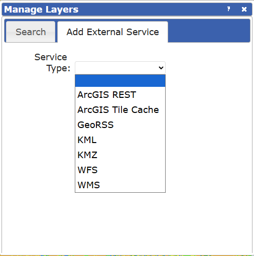

```{r setup, include=FALSE}
knitr::opts_chunk$set(echo = FALSE, message = FALSE, warning = FALSE)
```

# Objective

This project aims to develop a decision-support tool that integrates Tasmania’s Enterprise Suitability Mapping (soil, climate, and topography layers) with property listing data to identify land parcels matching user-selected crops, budgets, and locations. The tool will generate ranked property recommendations, highlight key limiting factors, and provide optional notifications for new listings that match user preferences.

By combining market availability with agronomic suitability, the tool seeks to transform static suitability maps into actionable insights for farmers and agribusinesses, improving site selection and supporting more confident, sustainable investment decisions in Tasmania. The project will be evaluated through selected case studies and will also and to inform potential expansion to state-wide or national-scale implementations. to guide future scaling.


# Part 1: Review of the Existing Tasmanian Enterprise Suitability Maps (TESM)

## Current model features

The Tasmanian Enterprise Suitability Map (TESM) is a comprehensive tool designed to help farmers, investors, and land managers understand what crops or agricultural enterprises are best suited to different parts of Tasmania. It integrates detailed information on soil, climate, and landscape characteristics to assess land suitability for various crops.

TESM combines high resolution digital soil mapping, climate modeling, and specific crop suitability rules developed in collaboration with industry experts and the Tasmanian Institute of Agriculture (TIA). These maps rate key factors like temperature, rainfall, soil properties, frost risk, drainage, and slope against the requirements of different crops to classify areas into categories such as well suited, suitable, marginally suitable, or unsuitable.

The current mapping assumes water for crop irrigation is available and therefore not a limiting factor to production. This assumption is made in order to enable an assessment of land potential based on soil and climate attributes, independent of current water limitations, and to support planning and investment decisions that align with the scope of new irrigation infrastructure projects in Tasmania, particularly those driven by initiatives such as the [Water for Profit](https://www.utas.edu.au/tia/research/research-projects/project/agricultural-systems/water-for-profit) program, which has expanded irrigation capacity and underpinned decision support for Tasmanian agriculture. The program operates through co-investment models where government funds subsidize infrastructure and development costs, but farmers and enterprises contribute financially for access and ongoing usage, so water is not provided free of charge (Kidd et al, 2015).

This mapping supports regional agricultural planning by identifying areas where crops could be introduced, intensified, or diversified and highlights potential risks and management considerations. It also incorporates projected climate change scenarios for 2030 and 2050 to help stakeholders plan for future shifts in suitability.

TESM data can be accessed and interacted with via [LISTmap](https://maps.thelist.tas.gov.au/listmap/app/list/map?bookmarkId=694984), where users can explore suitability ratings for different crops in specific locations and understand the limitations or manageable constraints of the land. Users can view and query the maps, zoom into specific locations, and overlay other relevant environmental or administrative spatial layers. Access to the suitability maps, crop rules and Enterprise fact sheets and user guides are provided on the [Enterprise Suitability Maps](https://nre.tas.gov.au/agriculture/investing-in-irrigation/enterprise-suitability-toolkit/enterprise-suitability-maps) page. \`Overall, TESM provides a science-based, spatially detailed guide to support sustainable agricultural development across Tasmania.

```{r, warning=F, message=F}
library(tidyverse)

crops_all <- readRDS("dataset/all_crops_df.rds")

```

```{r}
library(kableExtra)

crops_list <- crops_all |> 
  distinct(`Crop Type`)
```

```{r}
crops_types <- crops_list |>
  mutate(
    Type = case_when(
      # pastures
      str_detect(`Crop Type`, 
                 regex("clover|ryegrass|fescue|phalaris|lucerne|cocksfoot", 
                       ignore_case = TRUE)) ~ "pastures",
      # perennial horticulture (fruit, nuts and wine grapes)
      str_detect(`Crop Type`, 
                 regex("blueberries|cherries|hazelnuts|olives|raspberries|strawberries|tablewg|sparklingwg", 
                       ignore_case = TRUE)) ~ "perennial horticulture",
      # vegetables
      `Crop Type` %in% c("carrots", "carrotseed", "onions", "potatoes") ~ "vegetables",

      # cereals / oilseeds
      `Crop Type` %in% c("barley", "wheat", "linseed") ~ "cereals",

      # pharmaceuticals
      `Crop Type` %in% c("hemp", "poppies", "pyrethrum") ~ "pharmaceuticals",

      # forestry
      str_detect(`Crop Type`, 
                 regex("tree", ignore_case = TRUE)) ~ "forestry",
      TRUE ~ "unclassified"
    )
  )
```

```{r}
#| label: tbl-cropcommodity
#| tbl-cap: "List of All Current Crops in TESM"

grouped_tbl <- crops_types |>
  group_by(Type) |>
  summarise(
    `Crops` = paste(sort(unique(`Crop Type`)), collapse = ", "),
    .groups = "drop"
  ) |>
  # (optional) order the rows the way you want
  mutate(Type = factor(
    Type,
    levels = c("cereals","perennial horticulture","vegetables",
               "pharmaceuticals","pastures","forestry","unclassified")
  )) |>
  arrange(Type)

kable(grouped_tbl) |>
  kable_styling(full_width = FALSE) |>
  column_spec(2, width = "10cm")

```

The range of agricultural commodities covered in this map includes vegetables, cereals, pharmaceuticals, perennial horticulture, pastures, and forestry, with a detailed description of the crop–commodity type pairs provided in @tbl-cropcommodity.

#### Current Modelling Approach \newline

The Tasmanian Enterprise Suitability Maps (TESM) integrate soil, climate, and topographic attributes derived from **Digital Soil Mapping (DSM)** and **climate modelling**, which provide spatially continuous raster layers across the state. Crop suitability is determined by evaluating these environmental factors against crop-specific threshold values, defined according to crop performance requirements (@tbl-cropcommodity).

**Soil** drainage class is a particularly critical input, as it strongly influences whether irrigated enterprises can establish successfully; Kidd et al. (2014) demonstrated that integrating expert-based drainage estimates with DSM techniques produced predictive drainage surfaces with robust validation metrics

**Climate** inputs include frost risk, chill hours, growing degree days, extreme heat risk, and rainfall, all derived from extensive temperature sensor networks combined with terrain covariates

**Topographic** variables such as slope, elevation, and aspect are incorporated to capture effects on water movement, microclimates, and erosion potential. Together, these inputs are resampled into a consistent gridded format (typically 30–80 m resolution), enabling the creation of suitability surfaces that represent the continuous spatial variability of Tasmanian landscapes.

**Incorporation of Climate Futures Tasmania (CFT)**:Future climate projections (for 2030 and 2050) based on Representative Concentration Pathway 8.5 scenarios are integrated into the modelling to assess how suitability may change under projected climate conditions.

```{r}
crops_inputs <- crops_all |>
  pivot_longer(
    cols = -Crop_Type,    
    names_to = "Variable",  
    values_to = "Value"       
  ) |>
  select(Variable) |>     
  distinct()             

vars_clean <- crops_inputs |>
  mutate(Variable = str_squish(Variable)) |>
  filter(
    Variable != "",
    !str_detect(Variable, "^\\d+$"),
    Variable != "Rating",
    !str_detect(Variable, "^(\\.{3,}|…)\\d+$")
  ) |>
  filter(!str_detect(Variable, "^Aspect\\b")) |>
  # strip trailing explanatory text:
  #  - from " (" to end
  #  - from " C..." to end
  #  - from " <digit>..." to end
  mutate(
    Variable = Variable |>
      str_replace(" \\(.*$", "") |>
      str_replace(" C.*$", "") |>
      str_replace(" [0-9].*$", "") |>
      str_squish()
  ) |>
  filter(!str_detect(Variable, "^[\\.…\\s\\d]+$")) |>
  # family standardisation (keep original casing by default)
  mutate(var_lc = str_to_lower(Variable)) |>
  mutate(
    Variable_std = case_when(
      str_detect(var_lc, "frost")                     ~ "Frost risk",
      str_detect(var_lc, "rainfall|\\brain\\b")       ~ "Rainfall",
      str_detect(var_lc, "stone")                     ~ "Stone abundance",
      str_detect(var_lc, "chill\\s*hours?")           ~ "Chill hours",
      str_detect(var_lc, "daily maximum temperature") ~ "Daily maximum temperature",
      str_detect(var_lc, "electrical conductivity|\\becse\\b|\\bd?s/m\\b")
                                                                   ~ "Electrical conductivity",
      str_detect(var_lc, "extreme heat risk")                       ~ "Extreme heat risk",
      str_detect(var_lc, "\\bheat( at harvest| stress)?\\b")        ~ "Heat stress",
      str_detect(var_lc, "air temperature|mean maximum monthly (air )?temperature")
                                                                   ~ "Air temperature",
      TRUE                                                          ~ Variable   # <- keep original casing
    )
  ) |>
  mutate(
    Variable_std = str_replace_all(Variable_std, "\\bPh\\b", "pH")
  ) |>
  distinct(Variable_std) |>
  arrange(Variable_std) |>
  rename(Variable = Variable_std) |>
  select(Variable)

```

```{r}
vars_classified <- vars_clean |>
  mutate(var_lc = str_to_lower(Variable)) |>
  mutate(Class = case_when(
    # Climate 
    str_detect(var_lc, "\\bair temperature\\b") ~ "climate",
    str_detect(var_lc, "chill\\s*hours?") ~ "climate",
    str_detect(var_lc, "daily maximum temperature") ~ "climate",
    str_detect(var_lc, "extreme heat risk") ~ "climate",
    str_detect(var_lc, "frost risk|frost\\b") ~ "climate",
    str_detect(var_lc, "\\bgrowing degree days\\b|\\bgdd\\b") ~ "climate",
    str_detect(var_lc, "growing season temperature") ~ "climate",
    str_detect(var_lc, "hot weather during summer") ~ "climate",
    str_detect(var_lc, "\\brainfall\\b") ~ "climate",
    str_detect(var_lc, "\\bheat stress\\b") ~ "climate",

    # Topography 
    str_detect(var_lc, "\\bslope\\b") ~ "topography",
    str_detect(var_lc, "\\belevation\\b") ~ "topography",
    str_detect(var_lc, "\\baspect\\b") ~ "topography",  
    
    # Soil attributes
    str_detect(var_lc, "\\bsoil depth\\b|\\bsoil\\s*depth\\b|^soil depth$") ~ "soil",
    str_detect(var_lc, "\\bsoil depth\\b|\\bsoil depth\\b") ~ "soil",
    str_detect(var_lc, "soil drainage") ~ "soil",
    str_detect(var_lc, "soil texture|duplex soil") ~ "soil",
    str_detect(var_lc, "electrical conductivity|\\becse\\b|d?s/m") ~ "soil",
    str_detect(var_lc, "\\bpH\\b") ~ "soil",
    str_detect(var_lc, "stone abundance") ~ "soil",
    str_detect(var_lc, "depth to sodic layer") ~ "soil",
    str_detect(var_lc, "exchangeable calcium|exchangeable magnesium") ~ "soil",
    TRUE ~ "other"
  )) |>
  filter(Variable != "Crop Type") |>
  select(Variable, Class)

```

```{r}
#| label: tbl-allvariables
#| tbl-cap: "List of All Variables in TESM"

vars_tbl <- vars_classified |>
  filter(Class %in% c("soil", "climate", "topography")) |>
  mutate(Class = recode(Class, "soil" = "soil attribute")) |>
  group_by(Class) |>
  summarise(Variables = paste(sort(unique(Variable)), collapse = ", "),
            .groups = "drop") |>
  arrange(Class)
  
kable(vars_tbl, booktabs = TRUE, col.names = c("Class", "Variables")) |>
  kable_styling(full_width = FALSE) |>
  column_spec(2, width = "13cm") 

```

According to @tbl-allvariables, across the three classes, topography only has 2 variables, as opposed to soil attributes and climates that have more component. This different in number may reflect on how crop suitability being mapped, but this early finding does not determine anything important towards variable selection in TESM.

\newpage

**How these crops are determined suitable**

Tasmania’s Enterprise Suitability Maps (TESM) are modelled using a deterministic, rule-based framework grounded in digital soil assessment (DSA). The soil component relies on machine learning (interpolation) and geostatistical methods to predict soil attributes from field observations and environmental covariates while quantifying uncertainty. Climate and terrain factors are integrated through threshold rules derived from agronomic literature, expert workshops, and industry consultation.

The process uses a "most-limiting-factor" approach. This means that, even if most factors are excellent, just one poor factor can determine the overall suitability. In other words, the weakest link sets the limit:

**Suitability levels are usually scored or classified from**:

-   **1.0 Well suited**: All individual criteria are “Well suited.”

-   **2.0 Suitable**: "The lowest category among the criteria is Suitable, with all others rated higher.”

-   **3.0 Moderately suitable**: One or more “Moderately suitable” factors.

-   **4.0 Unsuitable**: Any factor is “Unsuitable” (or the land is protected, urban, or open water).

If a location scores “Well suited” for everything except drainage (which is “Unsuitable”), the whole site is deemed “Unsuitable” for that crop, because the poor drainage is expected to severely limit success.

**Improving Suitability** - If a limiting factor is considered manageable (a "manageable constraint"), landowners can take steps to address it. For example:

-   **Low soil pH** : Applying lime can raise pH, making the soil suitable for crops like barley.

-   **Poor drainage** : Installing drainage systems can help.

-   **Excess stones**: Stones can be mechanically or manually removed.

If such mitigations are feasible, the suitability rating may improve from “Moderately suitable” to “Suitable (with management).”

Suitability is determined by rating all important growing conditions, then choosing the lowest rating among these (the most limiting factor) as the overall score. If that limiting factor can be addressed by practical management techniques, the land’s suitability rating for a crop might be increased to reflect that potential improvement.

In summary, TESM combine expert-defined deterministic rules with advanced digital soil mapping to provide a practical, interpretable, and scientifically robust tool for land-use planning, acknowledging inherent limitations in data and modelling assumptions (Kidd et al., 2012; Kidd et al., 2014; Webb et al., 2014).

## Critically assess limitations

According to the each crop rules dataset, extracted from the [website,](https://nre.tas.gov.au/agriculture/investing-in-irrigation/enterprise-suitability-toolkit/enterprise-suitability-maps) each crops has different combination of crucial climate variables and topography to consider. This claim supported by [this data](https://nrmdatalibrary.dpipwe.tas.gov.au/FactSheets/WfW/ListMapUserNotes/Inventory_DCM_Tas.pdf) from Tasmanian Goverment. This makes modelling an accurate and reliable model for all crops challenging. Missing data happen in all variables.

Adding on, by investigating the crops rules dataset *(see Appendix Table A1)*, there are limitations of the lack of common/standardize variables. This makes the mapping harder, since the lack of common variables means the map is less reliable.

Another limitation is in the suitability framework, the integration of these attributes remains deterministic rather than probabilistic. Uncertainty estimates are not considered through into the final TESM. This makes the maps practical and user-friendly, but at the cost of underrepresenting the variability and confidence levels inherent in the underlying data. with limited flexibility and no formal propagation of uncertainty.

Although LISTmap provides an option to add external layers through formats such as WMS or KML and others *(see Appendix Figure A1)*, the main limitation lies in the availability of suitable data rather than the platform itself. High-resolution spatial datasets for niche or specialty crops are rarely produced because they require costly ground truthing, sensor calibration, and long-term monitoring. Even when data are available from sources such as New Zealand’s S-map or FAO’s GAEZ, the absence of locally collected, large-scale field data in Tasmania prevents the development of reliable crop maps for underrepresented commodities (Zhong et al., 2019; Zhang et al., 2024). This scarcity means that specialty crops cannot be mapped with the same spatial detail as mainstream commodities like cereals or fruit. Furthermore, integrating new data into LISTmap is not straightforward. Users must first prepare and host the datasets in platforms such as ArcGIS, then import them manually into LISTmap. Even then, integration may not function seamlessly, and formal inclusion of a new crop layer still requires request to the custodians of Tasmania’s agricultural spatial data at the Department of Natural Resources and Environment.

TESM provides a broad regional overview intended to guide where crops might be suitable at a broad scale. However, it is not a substitute for detailed, site-specific soil testing and on-farm investigations, which are essential before making any investment or operational decisions.

Despite the robustness of the spatial inputs and the transparency of the rule-based modelling approach, several limitations emerge when moving from data layers to practical suitability maps. The deterministic framework treats thresholds as fixed, without accounting for uncertainty in soil and climate predictions or variability in management practices. Moreover, while the rules capture key agronomic requirements, they may oversimplify interactions between factors such as soil drainage, temperature extremes, and crop management. As a result, the TESM provide a valuable first-pass planning tool, but their outputs must be interpreted with caution, particularly when extending to niche crops, areas with complex microclimates, or situations where farmers employ adaptive management strategies.

In addition to microclimatic variability, the maps also overlook differences in management practices that strongly influence crop outcomes. Access to water is a clear example: while rainfall and groundwater availability are well mapped, the actual feasibility of irrigation depends on proximity to dams, rivers, or irrigation infrastructure, which is not captured in the current models. Similarly, the effectiveness of pest and disease management can substantially alter yields on land that appears equally suitable in biophysical terms. Crop rotations and seasonal timing also affect soil resilience and productivity in ways that deterministic rules cannot reflect. By standardising these factors, TESM risk portraying land units as uniform when, in reality, farmers’ practices create significant variation in outcomes. This underscores the importance of integrating management related variables such as irrigation access and pest or disease pressure into future suitability frameworks, making them more reflective of real-world agricultural conditions.

### Recommendations for Current TESM Model

Incorporating factors such as **Pest and Disease** and **Irrigation feasibility** would make TESM more accurate, as it would include key management factors that affect results on farms. This would give the model greater value for decision-making and offer more practical guidance for specialty crops. It would also improve the reliability and strength of the assessments, helping to close the gap between mapped suitability and actual farm performance. In the end, these changes would make TESM a more useful tool for both regional planning and farm-level investment.

## Suggested Comparator Models

### **New Zealand S‑map & Crop Suitability Layers**

New Zealand’s national S-map integrates soil, climate, and terrain data at a 500 m resolution to assess crop suitability, including specialty crops such as truffles, hops, and few specialty wine grapes. It is jointly maintained by Plant & Food Research, [Manaaki Whenua Landcare Research](https://www.landcareresearch.co.nz/), [NIWA](https://niwa.co.nz/), and [MPI](https://www.mpi.govt.nz/). Compared to Tasmania’s TESM, the framework includes more explicit representation of biophysical constraints and yields expressed as a range, offering users insight into uncertainty.

-   Inputs: Soil (depth, pH, drainage from S-map), climate (temperature, rainfall from NIWA Virtual Climate Station), and terrain (slope, aspect).

-   Methods: Rule-based GIS modelling adapted from Kidd et al. (2015), similar to modelling reference of TESM, with suitability defined in four categories (well-suited, suitable, marginal, unsuitable) based on most-limiting factor logic. Rules are continuously refined with expert feedback.

-   Uncertainty: Yield estimates are presented as lower and upper bounds rather than single values, acknowledging inherent variability. Suitability classes carry a “moderate reliability” disclaimer at the national scale, since estimates depend on expert judgment, national yield statistics, and generalised soil–climate interactions.

-   Extensibility: Modular design allows addition of new crops and explicit management scenarios (e.g. irrigation, liming, drainage) demonstrate adaptability to different farm practices.

Compared to TESM, the New Zealand's S-map framework provides national-scale consistency and explicit yield ranges, though with less resolution for farm-level decisions.

### **FAO GAEZ: Agro-MAPS**

The FAO Global Agro-Ecological Zones (GAEZ) framework, with its [Agro-MAPS](https://gaez.fao.org/pages/agromaps) database, is a global land evaluation system designed to assess agricultural potential under current and future climate conditions. Unlike Tasmania’s TESM, which are state-level, GAEZ integrates global datasets on soils, climate, terrain, and agricultural statistics to evaluate suitability, potential yields, and yield gaps across multiple scales.

-   Inputs: Climate (historical and scenario-based, RCP futures), soils and terrain (from the Harmonized World Soil Database and SRTM slope data), land cover/use, phenology and crop calendars, population and livestock distributions, and national/subnational agricultural statistics.

-   Methods: Multi-module modelling system. Module I analyses agro-climatic variables (length of growing period, water balance, frost days); Module II calculates biomass and yields; Modules III–IV assess agro-climatic and edaphic (soil/terrain) constraints; Modules V–VII integrate evaluations, downscale production statistics, and compute yield gaps. Suitability is classed by limiting factors across irrigated conditions, with input/management levels considered.

-   Uncertainty: Addressed by scenario modelling (RCP climate pathways, CO2 fertilisation effects) and by providing ranges for yields and constraints. Downscaling of agricultural statistics incorporates calibration with national data.

-   Extensibility: Highly flexible. GAEZ accommodates multiple management levels, irrigation systems, and climate scenarios, and is updated iteratively (GAEZ v5 is underway). Crop sets can expand, and the framework links to biodiversity, protected areas, and socio-economic overlays for policy support.

Compared to TESM, GAEZ provides much broader geographic scope and scenario-based foresight, but at coarser resolution and less direct farm-scale applicability.

### Queensland Land Suitability Guidelines (DES)

The Queensland Land Suitability Guidelines (2nd edition, 2015), maintained by the Queensland Department of Environment and Science (DES), set out a standardised method for assessing how well land can support agricultural enterprises. Building on the FAO land evaluation framework, the guidelines provide a science-based, sustainable approach for matching land attributes (soil, climate, topography) with the requirements of specific crops or enterprises. The framework is widely used across Queensland for regional planning, environmental impact assessment, irrigation development, and protecting valuable farmland through agricultural land classification.

The guidelines assess land as it currently exists and apply the idea of the “most limiting factor,” meaning the worst problem on a site decides the final class. They use three related systems: the Land Suitability Classification (Classes 1–5 for specific crops), the Land Capability Classification (Classes I–VIII for general farming potential), and the Agricultural Land Classification (ALC) (Classes A–D for planning and policy purposes). Rainfall and soil water storage are very important, especially for dryland farming, because the model does not assume irrigation is always available. When irrigation is considered, the guidelines also check how well the soil can absorb water, which is treated as a key factor in performance. Another important feature is the recognition of acid sulfate soils, which can make land unsuitable due to environmental risks. Pests and diseases are also part of the evaluation, as long-term biological problems can lower land quality. In addition, the system considers a wide range of other issues such as erosion, flooding, slope, wetness, salinity, nutrient balance, vegetation regrowth, and rockiness. Unlike some other systems, these hazards are not just shown as extra information but are directly used to decide the final land class.

Compared to the Tasmanian Enterprise Suitability Maps (TESM), which provide ready made crop specific maps and assume irrigation availability, the Queensland guidelines serve as a flexible framework in which practitioners build rule sets tailored to each crop and region. While both apply the most limiting factor principle, Queensland covers a broader spectrum of hazards, including irrigation performance, acid sulfate soils, pests, and salinity, all of which can determine final suitability classes. TESM, by contrast, places stronger emphasis on climate metrics such as growing degree days and chill hours, and treats risks like erosion, salinity, and flooding as supplementary information layers. This makes Queensland’s model more comprehensive in hazard integration, while TESM is oriented towards streamlined mapping products that emphasise enterprise planning and future climate scenarios.

\newpage

### **Comparator Summary**

| Feature            | Tasmania TESM | NZ S-map & Crop Layers | FAO Agro-MAPS | QLD LSG |
|--------------------|---------------|------------------------|----------------------|--------------------------------|
| **Inputs**         | Soil, climate, topography from state datasets; assumes irrigation is available. | Soil attributes (S-map), climate (NIWA Virtual Climate Station), terrain; crop-specific rules. | Global climate (historical + scenarios), soils (HWSD), terrain (SRTM), land cover/use, crop calendars, ag. statistics (Agro-MAPS). | Soil, climate, topography; broader hazards including irrigation performance, acid sulfate soils, pests, salinity. |
| **Methods**        | Rule-based, deterministic thresholds; “most limiting factor” approach; outputs 9 suitability classes (with management options). | Rule-based GIS modelling, 4 suitability classes; expert-reviewed iterations; yields expressed as ranges. | Multi-module system (Modules I–VII): agro-climatic analysis, yield modelling, constraints, soil/terrain suitability, integration with national stats, yield gap analysis. | FAO land evaluation framework adapted for Queensland; practitioners build tailored rule-sets; applies most limiting factor principle. |
| **Uncertainty**    | Not explicitly quantified; only “manageable constraints” noted. | Yields given as lower/upper ranges; categorical maps rated “moderate reliability” at national scale. | Explicitly incorporates climate scenarios, CO2 effects, yield ranges, and calibration with national statistics. | Not directly quantified; comprehensiveness comes from inclusion of wider hazard classes. |
| **Extensibility**  | Crop list fixed but new crops added via rule-sets and consultation; designed for state planning. | Modular; new crops/scenarios can be added; includes specialty crops (e.g. truffles) and management scenarios (irrigation, drainage, liming). | Highly extensible: multiple management levels, irrigated vs rain-fed, climate change scenarios; regularly updated (v5 in development). | Flexible framework; rule-sets built per crop/region by practitioners; applied across regional planning and impact assessment. |
| **Scale/Resolution** | State of Tasmania; fine resolution (30–80 m); farm to regional planning. | National (NZ); 500 m resolution; suitable for regional benchmarking, not block-level. | Global; coarse (~5 arc-min, ~10 km); intended for national, regional, and global planning, not local farm scale. | Queensland-wide; applied for regional planning, EIA, irrigation development, and farmland protection. |


# Part 2: Literature Review on Emerging & Climate‑Resilient Crops

## Novelty Crop Selection

### 1. Quinoa

Quinoa *(Chenopodium quinoa)* is an annual pseudocereal originating from the Andes, traditionally cultivated between sea level and 4000 m. It is valued as a specialty, high-value crop due to its exceptional nutritional profile: a complete protein source, rich in essential amino acids, fiber, and micronutrients. Its reputation as a “superfood” has secured global demand, particularly in health-conscious and gluten-free markets, which makes it attractive for niche agricultural enterprises (Dehghanian et al, 2024).

A defining feature of quinoa is its climate resilience. It can tolerate drought, salinity (up to 15–75 dS/m), frost (to about –8 degrees C in certain ecotypes), and poor soils, while still producing reasonable yields. FAO GAEZ identifies it as suitable across diverse soil textures and altitudes, with optimal growing temperatures of 14–18 degrees C and tolerance from 2–35 degrees C. Quinoa is particularly well adapted to regions with bright light, moderate fertility soils, and well-drained profiles, conditions that align closely with the cool, sunny, and semi-arid microclimates found in parts of Tasmania.

For Tasmania, quinoa is notable as a novelty crop aligned with regenerative and small-scale organic systems. Its short lifecycle (90–120 days), adaptability to marginal soils, and compatibility with organic practices make it a candidate for rotation in mixed farming systems. While global quinoa supply has expanded, in Australia production remains limited, with pioneering cultivation led by farms such as [Kindred Organics](https://www.weeklytimesnow.com.au/agribusiness/farm-magazine/kindred-organics-pioneers-of-quinoa-keeping-the-craze-alive/news-story/07aad6541c5c07c439f7d39a1682999c) in northern Tasmania. This positions quinoa as both an [under-trial](https://www.completehome.com.au/outdoors/kindred-organics-quinoa-farm.html) and locally distinctive crop, offering opportunities for diversification, resilience against climate variability, and access to premium niche markets.

### 2. Ginseng

*Panax ginseng*, commonly referred to as Asian or Korean ginseng, is a perennial medicinal and aromatic herb long celebrated as the “king of herbs.” Traditionally used in East Asia for thousands of years, ginseng is prized for its root, which contains ginsenosides, gintonin, and polysaccharides, bioactive compounds linked to improved immunity, energy, and stress resistance. Its high economic value as a medicinal plant and as an ingredient in nutraceuticals and cosmeceuticals makes it a specialty crop with niche, high-return potential (Kim et al, 2024).

From an ecological standpoint, ginseng is climate-sensitive but highly valuable. FAO GAEZ identifies optimal growth under cool temperate to subtropical humid conditions (12–20 degrees C, tolerating 8–27 degrees C), with 700–1300 mm rainfall, high soil fertility, well-drained medium to organic soils, and pH 5.5–7. It is shade-requiring, thriving under forest canopies or artificial covers. This reliance on shaded, moist, and cold conditions, combined with a long growth cycle of 4–6 years, makes ginseng distinct from short-season annuals like quinoa. Its sensitivity to direct sun, pests, and soil imbalances underlines its “high-risk high-reward” nature.

In Tasmanian context, ginseng is notable as a novel but under-realized crop. The state’s cool winters, fertile soils, and established forestry landscapes provide ecological parallels to its native Asian habitats, making shaded valleys or agroforestry systems suitable niches. However, production in Australia has remained experimental and small-scale, with only a handful of growers persisting after earlier waves of enthusiasm, one of them is [41 Degrees South](https://www.thecitizen.org.au/articles/ginsengs-coals-newcastle-promise-never-quite-took). The long establishment time, labour-intensive harvest, and need for precise habitat replication have constrained its expansion. Nevertheless, as a specialty medicinal crop with global demand, particularly in East Asian markets, ginseng represents a unique diversification opportunity for regenerative systems in Tasmania, especially when integrated with shaded forest plantings or high-value organics.

### 3. Sea Buckthorne

Sea buckthorn *(Hippophae rhamnoides)* is a hardy, deciduous shrub native to cold-temperate regions of Eurasia. Traditionally used in food, medicine, and cosmetics, its berries are exceptionally rich in vitamin C (up to 2500 mg/100 g in Chinese varieties), carotenoids, unsaturated fatty acids, and phytosterols. These properties position it as a specialty, high-value crop with nutraceutical, cosmeceutical, and ecological applications. Its oil, derived from both seeds and pulp is particularly valued for cardioprotective, antioxidant, anti-inflammatory, and dermatological benefits, making sea buckthorn a candidate for both health-focused and value-added product markets (Olas, 2018).

Ecologically, sea buckthorn is climate-resilient and multifunctional. It tolerates extreme cold (–43 degrees C to –50 degrees C in dormancy) and heat up to 40 degrees C, while thriving on degraded, nutrient-poor, and even saline soils due to its nitrogen-fixing root symbiosis. It prefers well-drained sandy loams with neutral pH but is adaptable to a wide range of soils, including eroded landscapes. Its extensive root system stabilizes slopes, improves soil fertility, and prevents erosion, making it suitable for regenerative agriculture and land restoration. The plant is drought resistant but moisture-sensitive during flowering and fruiting, requiring supplementary irrigation in dry spring conditions, with plantations remaining viable for 30 years under proper management (Ren, 2020).

For Tasmania, sea buckthorn offers potential as a novel multipurpose crop under limited trial conditions. The island’s cool temperate climate, acidic but improvable soils, and growing demand for functional foods and organics provide a promising niche. Beyond its specialty fruit, the plant’s ecological soil enrichment ability, wildlife habitat, and slope stabilization, align with regenerative farming models. Although local production remains undeveloped, international examples (China, Canada, Europe) demonstrate both its commercial viability and ecosystem benefits, suggesting opportunities for Tasmanian diversification into nutraceuticals, cosmetics, and ecological restoration systems.

### 4. Mangolian Milkvetch

Mongolian milkvetch *(Astragalus membranaceus var. mongholicus)* is a hardy perennial plant from Mongolia and northern China. It is best known for its root, called *Huang Qi* in Traditional Chinese Medicine, where it has been used for thousands of years to strengthen the body, fight tiredness, and support heart and immune health. Scientists have found that the root contains unique compounds (such as astragalosides and flavonoids) that may help reduce inflammation, protect against stress, and improve recovery (Auyeung et al., 2016). Unlike crops that are grown in bulk for food, Mongolian milkvetch belongs to the group of high-value specialty crops, similar to saffron or truffles. The global market for Traditional Chinese Medicine is worth over USD 130 billion, and Astragalus products make up a significant share. This makes the crop attractive for farmers looking to grow something that is more about quality and value rather than just large volumes (Liu et al., 2020).

From a farming point of view, Mongolian milkvetch is a very resilient plant. It survives in a wide range of climates and soils, which makes it versatile compared to many other crops. It can handle cold winters down to –28 degrees C, which means frost is not a major threat, and it also tolerates warm summers. The plant needs moderate rainfall (around 500–900 mm each year) and prefers light sandy or loamy soils that drain well, since water logging can damage the roots. It can even grow in salty or less fertile soils, which makes it useful on land that is difficult for other crops. Because it is a legume, it naturally improves soil health by fixing nitrogen from the air. This reduces the need for chemical fertilizers and supports sustainable farming. Its deep roots make the plant drought-tolerant and help prevent erosion by holding the soil together. Farmers usually grow it for 12–15 months before harvesting the roots, which are the most valuable part of the plant (Wang et al., 2018).

In Tasmania, Mongolian milkvetch is still new and not yet a commercial crop. However, the Tasmanian Institute of Agriculture (TIA) has been trialling it since 2019 at research farms like Forthside. These trials are testing how well the plant adapts to Tasmanian soils and weather, how resistant it is to pests and diseases, and whether it can produce roots with high levels of the active medicinal compounds. So far, the results are promising, with good plant growth and root quality being reported. For Tasmania, the crop could be a good fit for several reasons: the cool climate suits its frost tolerance, the soil can be improved for its needs, and the state has a growing interest in niche, high value crops for export. If production challenges such as harvesting methods and efficiency can be solved, Mongolian milkvetch could offer Tasmanian farmers a new way to diversify, tap into the fast-growing herbal medicine market, and contribute to regenerative farming systems by improving soil health (Tasmanian Institute of Agriculture, 2021).

### 5. Truffle (*Tuber melanosporum* or Black Truffle)

*Tuber melanosporum*, known as the black truffle or French truffle, is a subterranean fungus forming a symbiotic relationship with oaks, hazelnuts, and other trees. It is highly valued as a luxury culinary product, contributing to niche gourmet and agritourism markets where harvest is closely linked to immediate consumption. Depending on species and quality, truffle prices can range from €600 to €6000 per kilogram. Their reputation as the “diamonds of the kitchen” reflects both rarity and gastronomic prestige, positioning them among the highest-value specialty crops suited to limited but profitable cultivation ventures (Allen & Bennett, 2021).

Ecologically, black truffles are demanding yet climate-resilient under the right conditions. S-map suitability rules specify optimal rainfall between 700–1500 mm, well-drained calcareous soils with pH 6.5–8.3, and mild summer temperatures averaging \>= 16 degrees C in January. Studies highlight that successful fructification depends not only on chemistry but also on physical soil properties, low fine earth and silt content, moderate clay, high bulk density, and good water-holding capacity, balancing aeration with soil moisture. Excess carbonates or waterlogging reduce yields, while supplementary irrigation can enhance production reliability in drier summers. Productive orchards require deep rooting (\>100 cm), loose stony soils, and slopes \<20 degrees, offering both drainage and stability.

For Tasmania, truffles have already proven their novelty crop potential. Since the first harvest in [Deloraine](https://www.afr.com/life-and-luxury/food-and-wine/meet-the-tasmanians-who-started-australia-s-truffle-industry-20250703-p5mcd4) in 1999, the state has emerged as a pioneer of the Australian truffle industry, with conditions in the central north mirroring those of Perigord, France. Early ventures demonstrated that Tasmania’s cool winters, calcareous soils, and temperate rainfall make it highly suited to truffle orchards. Today, farms such as the Terry family’s Deloraine plantation not only supply domestic markets but also drive agritourism through truffle hunts. While establishment requires significant upfront investment, inoculated tree plantations, and patience (first harvests after 5–8 years), truffles represent a distinctive Tasmanian opportunity that blends high-value specialty food production with ecosystem-compatible forestry.

\newpage 

## Crop Summary Requirements for Emerging & Climate-Resilient Crops


| Requirement   | Quinoa | Ginseng | Sea Buckthorn | Milkvetch | Truffle |
|---------------|--------|---------|---------------|-----------|---------|
| **Climatic** | Optimal 14–18 degrees C; tolerates 2–35 degrees C; rainfall 500–1000 mm (min 250); frost to –8 degrees C; drought and salinity tolerant. | Optimal 12–20 degrees C; tolerates 8–27 degrees C; rainfall 700–1300 mm; requires cold winters and shade. | Hardy to –43 degrees C (dormancy) and up to 40 degrees C; flowers at 10–15 degrees C; fruits with 14.5–17.5 degrees C effective temps. | Tolerates –28 degrees C winters and warm summers; rainfall 500–900 mm; resilient across diverse climates. | Optimal mild summers >=16 degrees C; rainfall 700–1500 mm; unsuitable <600 or >2000 mm; sensitive to waterlogging. |
| **Soil** | Light–medium, well-drained; tolerates poor fertility; pH 5.5–9.5. | Medium to organic; fertile, moist, well-drained; pH 5.5–7. | Sandy loam with organic matter; pH 6.5–7.5; nitrogen-fixing; tolerant of saline/eroded soils. | Prefers sandy or loamy, well-drained soils; tolerates salinity and poor fertility; nitrogen-fixing legume. | Calcareous, well-drained; pH 6.5–8.3; low silt, moderate clay; rooting depth >100 cm. |
| **Topography** | Sea level–4000 m; plains and valleys. | Forest valleys; <1200 m elevation. | Slopes, valleys, riverbeds; up to 2000 m; requires full sun. | Broad range; suited to marginal land; deep roots stabilize soil and prevent erosion. | Slopes <20degrees ; loose, stony soils aid drainage. |
| **Water** | Low requirement; dryland tolerant; irrigation improves yield. | Moisture-demanding; intolerant of drought; shade irrigation often needed. | Drought resistant but moisture-sensitive in spring; irrigation helps fruiting. | Moderate rainfall (500–900 mm); drought-tolerant once established; avoid waterlogging. | Supplementary irrigation often required in dry summers. |
| **Management** | 90–120 day cycle; relatively low pest/disease risk. | 4–6 years to harvest; hand-dug roots; pest- and stress-sensitive. | 4–5 years to fruit; dioecious (male + female); pests include aphids/fruit fly; plantation life ~30 yrs. | 12–15 months to harvest roots; perennial growth; improves soil nitrogen; relatively hardy but trials ongoing. | 5–8 years to first harvest; requires inoculated oak/hazel hosts; pruning and soil care critical. |
| **Markets** | High-value superfood; global demand; limited Tasmanian production. | High-value medicinal herb; strong Asian demand; small Tasmanian trials. | High-value berries; nutraceutical/cosmetic uses; no Tasmanian industry. | High-value TCM herb; global demand; Tasmanian trials since 2019. | Luxury gourmet (€600–6000/kg); export & agritourism; Tasmanian success since 1999. |
| **Model Inputs** | Rainfall, temperature range, frost risk, soil salinity, elevation. | shade proxy, winter chill, soil fertility, rainfall distribution. | Temp extremes, soil salinity, slope/erosion risk, nitrogen-fixing potential. | Rainfall, temperature extremes, soil salinity, soil fertility index, legume nitrogen-fixation potential. | Rainfall, summer temp, slope, soil pH, carbonate, drainage, rooting depth. |

 

# Resources

-   **TESM**: <https://nre.tas.gov.au/agriculture/investing-in-irrigation/enterprise-suitability-toolkit/enterprise-suitability-mapsy>

-   TESM Modelling References:

-   **NZ S‑map**: <https://smap.landcareresearch.co.nz/>

-   **FAO EcoCrop**: <https://ecocrop.fao.org/>

 

# Appendix

#### Table 1. All Crop Rules

```{r, warning=F, message=F}

head(crops_all,5)
```

#### Figure 1. Adding multiple GIS layers in Quarto \newline




 
