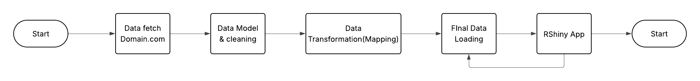
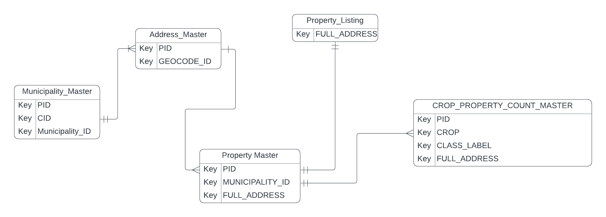

```{r setup, include=FALSE}
knitr::opts_chunk$set(echo = FALSE, message = FALSE, warning = FALSE)
```

# Abstract

Concise summary of purpose, methods, key results, and contribution.

_TBA_

# Introduction and Motivation

The Tasmanian Enterprise Suitability Map (TESM) is a geospatial decision-support tool that integrates soil, climate, and landscape data to classify land as well suited, suitable, marginally suitable, or unsuitable for a range of agricultural enterprises. Developed by the Tasmanian Institute of Agriculture (TIA) in collaboration with industry, TESM supports planning and investment by providing sciencebased assessments of crop potential across Tasmania. By making suitability information publicly accessible through LISTmap, it has become a cornerstone of agricultural planning and resource allocation in the state.

Despite its strengths, existing platforms present two key limitations. First, they respond poorly to changes in agribusiness trends, including the emergence of new crops that may become economically viable or strategically important for food security in the near future. Second, they are not directly linked with the property market, leaving a critical gap between geospatial crop suitability analysis
and the practical realities of land acquisition. Prospective buyers or agribusiness investors seeking to identify land parcels that align with their crop preferences must manually consult multiple sources, including property listing sites, agronomy reports, and local council data. This process is time-consuming, fragmented, and often discourages comprehensive due diligence.

Prospective buyers and landholders in Tasmania therefore lack an efficient mechanism to assess which crops are suitable for newly listed properties at the time they appear on the market. Current real-estate platforms do not integrate geospatial factors such as soils, climate, topography, or water access into actionable summaries, meaning that opportunities are frequently missed. This project addresses that gap by automatically assessing crop suitability for new property sales listings and directly linking users with properties that match their preferred crops. To achieve this, the project develops an integrated system that combines property listing information, cadastral parcel boundaries, and statewide crop suitability layers. This system computes parcel-level suitability and presents the results through an interactive Shiny dashboard, providing users with a more personalised and efficient way to evaluate investment opportunities.

Building on this problem statement, the present study redefines the role of TESM by moving beyond the static functions of LISTmap. The project develops an integrated system that links live property sales data with crop suitability assessments derived from TESM, providing users with a more personalised and efficient way to identify land that matches their preferred crops. By combining property listing
information, cadastral parcel boundaries, and statewide crop suitability layers, the system computes parcel-level suitability and delivers a more dynamic and actionable decision-support tool.

The significance of this research extends across several domains. For investors, the system enables better decision-making by reducing business risk and enhancing opportunity discovery. It assists those who already have specific crop strategies by identifying parcels that match their requirements as soon as they are listed, while also supporting landholders or capital investors who wish to explore which
crops are most suitable for a given parcel. For the agribusiness sector, it provides a scalable framework for integrating suitability analysis into real-time land acquisition decisions, enabling faster and more confident responses in an environment of rising land values, shifting crop demands, and climate uncertainty. By reducing the risk of costly misallocation, the system ensures that capital and resources are directed toward opportunities with the greatest long-term viability. For policy and planning bodies, the system demonstrates how public geospatial resources such as TESM can be re-purposed into practical, user-focused applications that bridge information gaps between government datasets and private-sector decision-making. It also highlights that these resources are not confined to a
small niche of agricultural specialists, but can deliver value to mainstream business communities, including property-based investors and developers. This broader relevance strengthens the case for continued improvement of TESM and LISTmap through the inclusion of additional variables and more sophisticated modelling approaches. By connecting suitability assessment with property market
dynamics, this project contributes to the creation of a more responsive, transparent, and data-driven agricultural investment environment in Tasmania.


\newpage

# Objective

This project aims to integrate TESM crop suitability layers with live property listing data in order to generate parcel-level suitability assessments. Building on this foundation, it develops an interactive Shiny dashboard that allows users to view ranked property recommendations, examine limiting factors, and directly access the corresponding property listings. The project also evaluates the tool’s functionality through case studies in Tasmania and explores its potential for broader application, extending to regions with comparable suitability datasets and to future industry-facing implementations.

\newpage

# Literature Review

## The Tasmanian Enterprise Suitability Map (TESM)

The [Tasmanian Enterprise Suitability Map (TESM)](https://nre.tas.gov.au/agriculture/investing-in-irrigation/enterprise-suitability-toolkit/enterprise-suitability-maps) represents a mature, data-driven framework for assessing agricultural potential across Tasmania. Originating from the [Wealth from Water](https://www.flinders.tas.gov.au/client-assets/images/Council/Downloads/Agendas/2015.02/Annex%206.%20Item%20A1%20Wealth%20from%20Water%20Brochure.pdf) program initiated in 2010 by the Tasmanian Department of Primary Industries, Parks, Water and Environment, which has since been restructured and renamed as the Department of Natural Resources and Environment Tasmania [(NRE Tas)](https://nre.tas.gov.au/) in collaboration with the Tasmanian Institute of Agriculture (TIA) and the University of Sydney, TESM sought to provide an objective, reproducible, and spatially explicit basis for agricultural development planning. The program was itself a direct response to the Innovation Strategy (2009) led by Jonathan West, which identified irrigation expansion as a transformative opportunity for Tasmania’s regional economy. The pilot phase initially covered about 70,000 hectares in the Meander Valley and Midlands, subsequently expanding to state-wide coverage through initiatives such as [Water for Profit](https://www.utas.edu.au/__data/assets/pdf_file/0008/1092068/TIA-Water-for-Profit-Brochure-2.pdf). In this progression, the emphasis shifted from qualitative soil surveys to Digital Soil Mapping (DSM) and Digital Soil Assessment (DSA) techniques that operationalised soil and climate data into decision-support tools for land managers and investors (Kidd, 2020).

TESM’s analytical foundation rests upon the integration of three primary data domains, consisting of soil, climate, and topography. The domains are processed through quantitative spatial modelling. The soil component draws on more than 900 core samples describing attributes such as pH, clay content, drainage class, and stone content. [Climate inputs](https://nrmdatalibrary.nre.tas.gov.au/FactSheets/WfW/ListMapUserNotes/Inventory_DCM_Tas.pdf) originate from a network of over 270 temperature sensors distributed across representative terrain positions, enabling fine-scale modelling of variables such as frost risk, chill hours, growing-degree days, and extreme heat frequency. Topographic variables, derived from Shuttle Radar Topography Mission (SRTM) data, gamma-radiometric imagery, and surface geology, capture slope, aspect, and elevation effects. These heterogeneous datasets are harmonised into raster layers at 30 to 80 m resolution and modelled using regression-tree and regression-kriging approaches to produce spatially continuous soil-attribute predictions with validation accuracies appropriate for regional-scale land evaluation (Kidd & Webb, 2015). The result is a three-dimensional digital representation of the Tasmanian soil landscape that supports downstream suitability analyses.

The suitability evaluation itself employs a deterministic, rule-based framework derived from the Food and Agriculture Organization (FAO, 1976) land-evaluation system and refined through the “most-limiting-factor” principle articulated by Klingebiel and Montgomery. Each crop or enterprise is governed by a rule set developed jointly by TIA researchers and industry experts, defining optimal and limiting parameter thresholds across the soil–climate–topography continuum. The model classifies each grid cell into four main hierarchical categories, i.e. _well suited_ , _suitable_ , _marginally suitable_ , _unsuitable_ based on the lowest-rated criterion. Thus, if drainage or frost risk is poor even when all other factors are optimal, the overall classification defaults to “unsuitable.” This conservative logic enhances interpretability and ensures that biophysical limitations are not overlooked in investment decisions. The framework also differentiates between _manageable_ and _unmanageable_ constraints, acknowledging that interventions such as liming or artificial drainage can upgrade a site’s effective suitability (Kidd et al., 2015).

Following early operational success, the project advanced to produce state-wide 3D soil-attribute maps at 80 m resolution, later refined to 30 m, which were integrated into the national [Terrestrial Ecosystem Research Network (TERN)](https://www.tern.org.au/) and [GlobalSoilMap.net](https://isric.org/projects/globalsoilmapnet) repositories (Kidd & Webb, 2015). Complementary climatic projections from [Climate Futures for Tasmania](https://climatefutures.org.au/climate-futures-for-tasmania/) were incorporated to generate suitability layers for 2030 and 2050 under [Representative Concentration Pathway (RCP) 8.5 scenarios](https://www.climatechangeinaustralia.gov.au/en/changing-climate/future-climate-scenarios/greenhouse-gas-scenarios/). Each enterprise is therefore represented by three temporal surfaces of current (2018), near-future (2030), and long-term (2050), enabling preliminary adaptation planning. An aggregated [Enterprise Versatility Index (EVI)](https://www.thelist.tas.gov.au/app/content/data/geo-meta-data-record?detailRecordUID=d56c5151-9eef-49aa-9712-4f700d65547e) summarises the number of viable enterprises/crops per grid cell, thereby identifying land parcels capable of diversified production. The integration of these high-resolution soil and climate grids has substantially improved Tasmania’s ability to visualise spatial heterogeneity in agricultural potential.

The Tasmanian wine sector provides a salient example of TESM’s applied relevance. Building on earlier climate modelling (Webb et al., 2015, 2018), the Enterprise suitability mapping and Tasmania’s wine sector (Brullo et.al, 2024) demonstrates how TESM outputs guide site selection for viticulture by combining frost-risk surfaces, growing-degree-day thresholds, and soil-drainage indices. These analyses have supported Tasmania’s transition toward high-value sparkling and cool-climate table wines, where irrigation expansion and land-use zoning are strategically coordinated with biophysical suitability. TESM data are increasingly used by policy agencies to outline priority irrigation districts and agricultural investment zones, reinforcing its dual role as a scientific and economic planning instrument.


\newpage

```{r, warning=F, message=F}
library(tidyverse)

crops_all <- readRDS("dataset/all_crops_df.rds")

```

```{r}
library(kableExtra)

crops_list <- crops_all |> 
  distinct(`Crop Type`)
```

```{r}
crops_types <- crops_list |>
  mutate(
    Type = case_when(
      # pastures
      str_detect(`Crop Type`, 
                 regex("clover|ryegrass|fescue|phalaris|lucerne|cocksfoot", 
                       ignore_case = TRUE)) ~ "pastures",
      # perennial horticulture (fruit, nuts and wine grapes)
      str_detect(`Crop Type`, 
                 regex("blueberries|cherries|hazelnuts|olives|raspberries|strawberries|tablewg|sparklingwg", 
                       ignore_case = TRUE)) ~ "perennial horticulture",
      # vegetables
      `Crop Type` %in% c("carrots", "carrotseed", "onions", "potatoes") ~ "vegetables",

      # cereals / oilseeds
      `Crop Type` %in% c("barley", "wheat", "linseed") ~ "cereals",

      # pharmaceuticals
      `Crop Type` %in% c("hemp", "poppies", "pyrethrum") ~ "pharmaceuticals",

      # forestry
      str_detect(`Crop Type`, 
                 regex("tree", ignore_case = TRUE)) ~ "forestry",
      TRUE ~ "unclassified"
    )
  )
```

```{r}
#| label: tbl-cropcommodity
#| tbl-cap: "List of All Current Crops in TESM"

grouped_tbl <- crops_types |>
  group_by(Type) |>
  summarise(
    `Crops` = paste(sort(unique(`Crop Type`)), collapse = ", "),
    .groups = "drop"
  ) |>
  # (optional) order the rows the way you want
  mutate(Type = factor(
    Type,
    levels = c("cereals","perennial horticulture","vegetables",
               "pharmaceuticals","pastures","forestry","unclassified")
  )) |>
  arrange(Type)

kable(grouped_tbl) |>
  kable_styling(full_width = FALSE) |>
  column_spec(2, width = "10cm")

```

Despite its technical sophistication, the Tasmanian Enterprise Suitability Model (TESM) has several recognised limitations. Its spatial accuracy depends on data density, declining in sparsely surveyed regions. The assumption of universal irrigation can overestimate suitability in dryland areas, and deterministic thresholds do not account for uncertainty, making results sensitive to small input changes. TESM also provides a static snapshot rather than a dynamic forecasting tool, and the administrative process for adding new crops limits responsiveness to emerging industries.

Nevertheless, TESM remains a significant contribution to digital soil assessment in Tasmania. It represents one of Australia’s most comprehensive applications of digital soil modelling, integrating DSM, rule-based evaluation, and climate projections to support evidence-based agricultural planning. While its fixed thresholds and irrigation assumptions highlight the need for more flexible and uncertainty-aware systems, TESM continues to serve as a robust first-pass planning tool that translates complex soil–climate data into practical, interpretable suitability information.


## Approaches to Crop Suitability Mapping (Change Later)

Beyond deterministic rulesets, newer approaches either quantify uncertainty explicitly or learn interactions from data. Crop-suitability modelling spans a spectrum from deterministic, rule-based classifications to probabilistic and hybrid frameworks. Deterministic systems remain attractive because their thresholds and limiting factors are transparent and easy to audit, but they risk brittleness when small measurement errors or local idiosyncrasies push a site across a class boundary. Malone and Kidd outline how conventional land-evaluation pipelines can be extended to quantify and propagate uncertainty using probabilistic thresholds, fuzzy membership functions, and Monte-Carlo style perturbations, so that maps communicate confidence as well as class labels. They also emphasise that “most-limiting-factor” logic, while interpretable, should be complemented by methods that express the likelihood of class membership, particularly where input layers carry nontrivial prediction error. (Malone & Kidd, 2015)

```{r}
crops_inputs <- crops_all |>
  pivot_longer(
    cols = -Crop_Type,    
    names_to = "Variable",  
    values_to = "Value"       
  ) |>
  select(Variable) |>     
  distinct()             

vars_clean <- crops_inputs |>
  mutate(Variable = str_squish(Variable)) |>
  filter(
    Variable != "",
    !str_detect(Variable, "^\\d+$"),
    Variable != "Rating",
    !str_detect(Variable, "^(\\.{3,}|…)\\d+$")
  ) |>
  filter(!str_detect(Variable, "^Aspect\\b")) |>
  # strip trailing explanatory text:
  #  - from " (" to end
  #  - from " C..." to end
  #  - from " <digit>..." to end
  mutate(
    Variable = Variable |>
      str_replace(" \\(.*$", "") |>
      str_replace(" C.*$", "") |>
      str_replace(" [0-9].*$", "") |>
      str_squish()
  ) |>
  filter(!str_detect(Variable, "^[\\.…\\s\\d]+$")) |>
  # family standardisation (keep original casing by default)
  mutate(var_lc = str_to_lower(Variable)) |>
  mutate(
    Variable_std = case_when(
      str_detect(var_lc, "frost")                     ~ "Frost risk",
      str_detect(var_lc, "rainfall|\\brain\\b")       ~ "Rainfall",
      str_detect(var_lc, "stone")                     ~ "Stone abundance",
      str_detect(var_lc, "chill\\s*hours?")           ~ "Chill hours",
      str_detect(var_lc, "daily maximum temperature") ~ "Daily maximum temperature",
      str_detect(var_lc, "electrical conductivity|\\becse\\b|\\bd?s/m\\b")
                                                                   ~ "Electrical conductivity",
      str_detect(var_lc, "extreme heat risk")                       ~ "Extreme heat risk",
      str_detect(var_lc, "\\bheat( at harvest| stress)?\\b")        ~ "Heat stress",
      str_detect(var_lc, "air temperature|mean maximum monthly (air )?temperature")
                                                                   ~ "Air temperature",
      TRUE                                                          ~ Variable
    )
  ) |>
  mutate(
    Variable_std = str_replace_all(Variable_std, "\\bPh\\b", "pH")
  ) |>
  distinct(Variable_std) |>
  arrange(Variable_std) |>
  rename(Variable = Variable_std) |>
  select(Variable)

```

```{r}
vars_classified <- vars_clean |>
  mutate(var_lc = str_to_lower(Variable)) |>
  mutate(Class = case_when(
    # Climate 
    str_detect(var_lc, "\\bair temperature\\b") ~ "climate",
    str_detect(var_lc, "chill\\s*hours?") ~ "climate",
    str_detect(var_lc, "daily maximum temperature") ~ "climate",
    str_detect(var_lc, "extreme heat risk") ~ "climate",
    str_detect(var_lc, "frost risk|frost\\b") ~ "climate",
    str_detect(var_lc, "\\bgrowing degree days\\b|\\bgdd\\b") ~ "climate",
    str_detect(var_lc, "growing season temperature") ~ "climate",
    str_detect(var_lc, "hot weather during summer") ~ "climate",
    str_detect(var_lc, "\\brainfall\\b") ~ "climate",
    str_detect(var_lc, "\\bheat stress\\b") ~ "climate",

    # Topography 
    str_detect(var_lc, "\\bslope\\b") ~ "topography",
    str_detect(var_lc, "\\belevation\\b") ~ "topography",
    str_detect(var_lc, "\\baspect\\b") ~ "topography",  
    
    # Soil attributes
    str_detect(var_lc, "\\bsoil depth\\b|\\bsoil\\s*depth\\b|^soil depth$") ~ "soil",
    str_detect(var_lc, "\\bsoil depth\\b|\\bsoil depth\\b") ~ "soil",
    str_detect(var_lc, "soil drainage") ~ "soil",
    str_detect(var_lc, "soil texture|duplex soil") ~ "soil",
    str_detect(var_lc, "electrical conductivity|\\becse\\b|d?s/m") ~ "soil",
    str_detect(var_lc, "\\bpH\\b") ~ "soil",
    str_detect(var_lc, "stone abundance") ~ "soil",
    str_detect(var_lc, "depth to sodic layer") ~ "soil",
    str_detect(var_lc, "exchangeable calcium|exchangeable magnesium") ~ "soil",
    TRUE ~ "other"
  )) |>
  filter(Variable != "Crop Type") |>
  select(Variable, Class)

```

```{r}
#| label: tbl-allvariables
#| tbl-cap: "List of All Variables in TESM"

vars_tbl <- vars_classified |>
  filter(Class %in% c("soil", "climate", "topography")) |>
  mutate(Class = recode(Class, "soil" = "soil attribute")) |>
  group_by(Class) |>
  summarise(Variables = paste(sort(unique(Variable)), collapse = ", "),
            .groups = "drop") |>
  arrange(Class)
  
kable(vars_tbl, booktabs = TRUE, col.names = c("Class", "Variables")) |>
  kable_styling(full_width = FALSE) |>
  column_spec(2, width = "13cm") 

```

Against this backdrop, the Tasmanian DSA/ESM tradition exemplifies a deterministic ruleset applied to gridded soil and climate covariates, with an explicit “most-limiting-factor” aggregation to derive the overall class per pixel. Rules are compiled from agronomic literature and expert workshops, thresholds are evaluated per attribute, and the lowest (i.e., most limiting) attribute determines the final class. This architecture delivers high interpretability and aligns well with stakeholder expectations about “what limits what,” but it also motivates complementary representations (e.g., fuzzy limits) when classes hinge on narrow cut-offs or when inputs have known error bands. (Kidd et al., 2015)

A parallel stream of work explores machine-learning and hybrid methods that retain expert structure while learning nonlinear interactions from data. Open-source frameworks such as [CropSuite v1.0](https://gmd.copernicus.org/articles/18/1067/2025/) combine modular crop response functions, climate/soil drivers, and flexible scoring to simulate suitability under alternative scenarios. The platform shows how open architectures can encode expert knowledge yet remain extensible as new covariates or crops are added, an attractive property when emerging commodities or climate adaptations are under consideration. (Zabel, 2022; Taghizadeh-Mehrjardi et al., 2020; Abdelrahrahman, 2021)
National-level example further illustrate design choices around resolution, transparency, and uncertainty. The [New Zealand S-Map](https://ourenvironment.scinfo.org.nz/maps-and-tools/app/Crop%20Suitability) that linked suitability work for perennial crops integrates phenology-aware climate indicators (e.g., bud-break timing) with frost-risk functions. This feature avoids single-indicator brittleness by combining risk components (frost and bud-break) so that delayed phenology does not falsely appear “low-risk” in very cold regions. Scenario analyses then trace suitability shifts under RCP pathways, making explicit how scores move as climate drivers change, a template for communicating both present-day classification and future risk envelopes (Vetharaniam et al., 2020; SLMACC Project 405422, 2020).

At the global scale, the FAO Global Agro-Ecological Zones (GAEZ) framework [(Agro-MAPS)](https://gaez.fao.org/pages/ecocrop-search) evaluates suitability, potential yields, and yield gaps by integrating harmonised soils/terrain, climate (historical and scenario-based), land cover and crop calendars, and agricultural statistics within a multi-module system (agro-climate, biomass/yield, edaphic constraints, integration/downscaling). Uncertainty is handled via scenario modelling (e.g., RCP pathways, $CO_2$ fertilisation) and by providing ranges for yields and constraints. Compared with TESM’s state-level deterministic rules (and S-Map’s national, phenology-aware risk composition discussed above), GAEZ offers much broader spatial scope and scenario-rich foresight, but at coarser resolution and with less direct farm-scale applicability. (FAO GAEZ v4 Documentation, 2022)

Taken together, contemporary suitability mapping is converging on hybrids: rule-based logic for transparency; probabilistic or fuzzy treatment for uncertainty; and modular, open tools for extensibility. Case studies from Tasmania (deterministic, interpretable rules over high-resolution inputs), New Zealand (phenology-aware, scenario-tested climate risk composition), and national zonation work (policy-ready aggregation) collectively suggest a practical path: retain expert-defined constraints where they are well established, but surface uncertainty and scenario sensitivity wherever inputs, thresholds, or management assumptions are weak. This orientation both improves scientific robustness and yields outputs that are directly actionable for investors, planners, and end-users who must make decisions under uncertainty (Malone & Kidd, 2015; Vetharaniam et al., 2020; Benson, 2016; Zabel, 2022). Yet even the most robust models must be delivered through interfaces that non-specialists can interrogate; this is the role of modern GIS-enabled decision support.

## Geographic Information Systems (GIS) and Spatial Decision Support (Change Later)

Web-based GIS and [SDSS](https://atlas.co/glossary/spatial-decision-support-systems/) operationalise those models, turning layered rasters and rules into auditable, interactive decisions. Geographic Information Systems (GIS) form the analytical backbone of modern spatial decision-making, enabling the integration of diverse environmental, climatic, and socioeconomic data into unified analytical frameworks. Carver (2015) articulated this transition from early stand-alone GIS models to participatory, web-enabled spatial decision support systems (SDSS), emphasizing how web-based GIS/multi-criteria evaluation (MCE) systems allow wider public access and enhance transparency in spatial planning. The shift from desktop-based GIS to web-delivered applications addressed a central limitation of earlier decision tools by allowing distributed users and policy stakeholders to interact directly with spatial layers and evaluation criteria online. This transformation established the conceptual foundation for modern geospatial dashboards and real-time mapping interfaces used in environmental management and land-use allocation.

Recent technological developments have further advanced GIS toward integrated, real-time territorial intelligence systems. The Trasimeno Smart Land initiative in central Italy exemplifies this evolution, extending Smart City principles into rural landscapes by combining 3D geospatial data, IoT sensors, and citizen-reported information through an integrated territorial platform (PITER) (Bianconi et al, 2025). The project operationalizes the Digital Twin concept for regional governance, integrating 24 thematic layers to monitor infrastructure, public works, and land-use change dynamically. Its modular and interoperable architecture ensures high data quality and scalability, providing a replicable model for rural or fragmented territories. This case underscores how GIS, when paired with continuous sensor networks and participatory reporting, can transform static mapping into a living decision-support environment for sustainable land management.

Parallel progress is evident in sector-specific web-based tools. Kim et al. (2025) developed the Web-based Rainfall Erosivity Calculation (WREC) tool, which integrates minute-interval rainfall datasets with simplified estimation models to generate high-resolution erosivity maps across South Korea. By embedding a rainfall-erosivity algorithm into a web interface, WREC enables planners and agricultural engineers to derive accurate soil-erosion risk indicators without specialized programming expertise. This demonstrates the power of web-based GIS systems to translate complex environmental models into accessible interfaces, fostering data democratization and reproducible environmental planning.

Similarly, Deval et al. (2022) introduced [Pi-VAT (Prioritization-Visualization and Analysis Tool)](https://github.com/devalc/Pi-VAT), a Shiny-based geospatial dashboard for hydrologic and watershed management. Built on the R Shiny framework, Pi-VAT synthesizes output from process-based models such as WEPP and SWAT into interactive maps and plots, enabling managers to compare “what-if” scenarios across multiple watersheds and management treatments. The system’s use of open-source components, such as Leaflet, Plotly, and DataTables to illustrates how R’s geospatial ecosystem supports dynamic spatial analysis without proprietary software. Importantly, Pi-VAT bridges scientific modelling and stakeholder engagement, a critical step toward collaborative environmental governance.

The ExActR platform (Gibbons et al., 2025) represents a further refinement of this web-based paradigm, offering an open-source Shiny application for compiling ecosystem extent accounts under the UN System of Environmental Economic Accounting (SEEA-EA). ExActR enables users to load shapefiles, generate land-cover change tables, and visualize them through Leaflet maps and barplots to transform complex geospatial workflows into intuitive dashboards. The integration of R packages such as sf, terra, and shinydashboard confirms that open-source GIS environments can support reproducible, scalable, and user-friendly decision tools aligned with international accounting standards.

Together, these studies illustrate a coherent trajectory: from static, expert-oriented GIS systems toward interactive, web-enabled, and participatory decision platforms. While accessibility and visualization have dramatically improved, challenges remain in ensuring interoperability among heterogeneous data sources and maintaining performance when handling high-resolution datasets. Nevertheless, the convergence of web-based GIS, real-time data integration, and open-source toolkits marks a decisive shift in environmental decision support. Within this evolving context, the current project’s Shiny-based dashboard builds directly on these advancements, extending the logic of Carver’s early web-SDSS vision and the functionality of tools such as Pi-VAT and ExActR to integrate Tasmania’s crop-suitability maps (TESM) with real-estate listings. In doing so, it transforms GIS from a back-end analytical engine into a front-end decision interface that connects agronomic suitability, spatial intelligence, and market accessibility for sustainable agricultural investment. However, most SDSS remain adjacent to the property market rather than embedded within it.

## PropTech and the Digitalisation of Land Information (Change Later)

Property technology (PropTech) platforms primarily optimise discovery, valuation and transaction workflows. A recent bibliometric review shows that research and tools cluster around ICT, smart-city applications and market decision systems, not the integration of agronomic indicators (soil productivity, topography, irrigation access) into listings or investor tools (Naeem et al., 2023). This asymmetry explains why due-diligence for agricultural use remains manual: listing metadata are decoupled from soil–climate–terrain evidence. Accordingly, the present work focuses on the geospatial data engineering and model exposition required to connect TESM-derived suitability to live listings.


## Real-Estate Listing Platforms and Agricultural Land Information (Change Later)

An audit of mainstream property platforms in Australia (e.g., Domain, RealEstate.com.au) and rural-focused sites (e.g., Farmbuy, Farmproperty) shows indication to emphasise transactional attributes, such as parcel area and boundaries, buildings, tenure, access to services, and local amenity. These interfaces rarely expose verified biophysical layers (soil chemistry, drainage class, frost/chill metrics, slope), nor do they provide reproducible suitability logic. Where “suitable crops” are listed, claims are typically seller-supplied and lack traceable links to datasets or rule sets, leaving buyers to manually cross-reference external sources (e.g., government soil maps, climate rasters, council overlays). This workflow is fragmented and time-consuming for agribusiness users, and it systematically disadvantages non-GIS specialists who cannot efficiently assemble soil–climate–topography evidence for decision-making.

The absence of verifiable biophysical evidence on listings is not a trivial omission; it goes to the heart of what “suitability” means. Snelder et al. demonstrate that land-use suitability is not an intrinsic property of a parcel. Rather, suitability depends on landscape-level choices, environmental objectives, and the subjective weighting of indicators, hence any unverified, listing-level claim of “suitable for crop X” is, by construction, contestable without explicit data and methodological transparency. Their framework shows that suitability emerges from composite indicators (productive potential, relative contribution to downstream effects, environmental pressure), each contingent on regional targets and modelled processes; as a result, map outputs are most reliable for broadscale planning and should be interpreted with care at parcel scale unless inputs and choices are made explicit. 

This perspective clarifies why buyer due diligence currently feels manual and uncertain: listing sites surface market metadata, while suitability assessments require landscape-aware, indicator-driven spatial analysis. In practice, a prospective buyer must stitch together multiple external sources, consist of soil and climate layers, water access records, and zoning/constraint overlays, to approximate an evidence base. The literature confirms the need for such multi-source synthesis. Spataru et al., working in peri-urban Melbourne, show that agricultural planning rests on assembling heterogeneous datasets and engaging stakeholders to make sense of competing land-use pressures; their findings highlight how agricultural potential and market forces collide in data-sparse, rapidly changing interfaces between urban and rural systems. Although their case targets metropolitan edges rather than farm-dominant regions, it underscores the institutional and informational fragmentation that buyers face when trying to align investment with biophysical opportunity. 

Tasmanian planning materials point to a complementary governance reality. The Agricultural Land Mapping Project (ALMP) and the associated Decision Tree and Zoning Guidelines (Tempest & Ketelaar) were created to help councils delineate Agriculture and Rural Zones. Critically, the guidance acknowledges that the ALMP’s generic decision rules and desktop GIS can produce anomalies, and it recommends external expert review where automated outputs are ambiguous. Zoning decisions are expected to consider land capability, constraints mapping, irrigation resources, and connectivity, with explicit references to statewide GIS layers (e.g., “Land Potentially Suitable for Agriculture”) and to water-resource portals (e.g., WIST, groundwater bores) for checking irrigation feasibility. These materials emphasise that sound land-use allocation depends on integrating formal spatial datasets and policy criteria, the kinds of layers and logic that listing platforms do not provide natively. 

Taken together, the literature and planning guidance converge on the same problem your audit exposed: platform-level information is decoupled from biophysical evaluation. Snelder et al. caution that suitability mapping choices (e.g., indicator weights, environmental objectives) introduce subjectivity and that outputs are sensitive to scale and uncertainty; they recommend interactive GIS interfaces so users can inspect indicators and recombine assumptions transparently. In the current ecosystem, listing sites offer neither the datasets nor the analytic controls to satisfy that recommendation, forcing buyers to reconstruct the evidence base outside the marketplace. This gap explains why agribusiness investors experience a manual, error-prone cross-referencing process when attempting to align crop preferences with on-market parcels, and why opportunities can be missed when markets move faster than due-diligence workflows. 

These findings directly motivate the present project’s design choice: to embed verified geospatial suitability (soil–climate–topography and irrigation-relevant cues) alongside live property listings, within an interactive, auditable interface. By coupling TESM-derived suitability summaries at the parcel level with links to source layers and planning-relevant resources (e.g., irrigation and constraint overlays), the tool aligns with the literature’s call for transparent indicator composition and council guidance on multi-layer evidence. In short, the project aims to transform listing discovery from a seller-narrative space into a data-substantiated decision space, reducing fragmentation and bringing agronomic credibility to property search in Tasmania. Hence, the marketplace exposes availability but not verifiable biophysical suitability, obliging manual cross-referencing.


## The Integration Gap (Change Later)

This structural disconnect (modelled suitability on one side, market discovery on the other) defines the integration gap. A consistent theme across the preceding subsections is the structural disconnect between spatial analytics and market-facing property information. On the one hand, land-suitability science (e.g., TESM/DSA) aggregates soil, climate, and terrain into interpretable, rule-based classifications; on the other, PropTech platforms optimise for transaction readiness, valuation signals, and user-generated content. The consequence is that investors, planners, and buyers encounter market data devoid of biophysical evidence, while suitability maps remain institutionally and technically decoupled from live listings. Conceptually, this gap is not merely a UX shortcoming: suitability itself is context-dependent and indicator-composed, not an intrinsic parcel attribute, which means that claims made in listing text without linked indicators, weights, and objectives are inherently fragile. This underscores the need for interfaces that expose indicator logic and uncertainty alongside availability, rather than treating “suitability” as a static label. 

Within the suitability tradition, Tasmania’s digital soil assessment demonstrates the strengths of transparent rule sets over high-resolution DSM and climate grids, but it also illustrates where uncertainty handling and scenario-sensitivity must be surfaced for decision support. Probabilistic and fuzzy approaches (e.g., simulation of input error, membership functions) provide materially different appraisals of where land sits relative to class thresholds, compared with crisp cut-offs alone; this is particularly salient at parcel scale and in marginal environments where small input errors flip classes. In short, best practice suggests coupling interpretable rules with explicit uncertainty communication to avoid overconfidence when maps are pulled into investment contexts or used in real time. 

From a governance perspective, data policy and institutional plumbing also impede integration. International guidance emphasises that modern land institutions should leverage digital interoperability, earth observation, and transparent registries to lower frictions, improve equity, and enable evidence-based planning; yet many registries and platforms still lack the interfaces (or mandates) to publish and consume geospatial suitability layers with provenance and audit trails. Likewise, cadastral consolidation and spatial planning instruments are designed to integrate multi-sector layers (agriculture, water, nature, infrastructure) but are rarely connected to the retail discovery layer where buyers actually act. A durable bridge therefore requires not only technical joining of GIS and PropTech, but also policy alignment around publication standards, indicator disclosure, valuation neutrality, and user rights. 

AgriSuit, a software developed jointly by Matrix Geoscience and Monash University (Business Analytics Creative Activity) is a Shiny-based decision-support platform that operationalises the integration of PropTech listing streams with enterprise/crop-suitability mapping. The system maintains a continuously updated backend database that ingests key attributes from online property listings (e.g., address, indicative price range, locality) and links them to cadastral parcels. For each parcel, AgriSuit computes TESM-derived suitability summaries at the parcel level (including limiting factors) and exposes the indicator logic so that users can trace how soil, climate, and topography contribute to the result. Where feasible, the interface also surfaces uncertainty cues and provides auditable links to source layers, enabling transparent verification.

To reduce noise and improve relevance, the database excludes clearly non-market parcels (e.g., national parks, charitable holdings, government-owned land), thereby focusing attention on properties that are actually available for purchase. The user experience is designed for non-specialists as well as sector insiders: prospective investors can filter by municipality or specific address (when listed) to identify crops that are biophysically compatible with a parcel, while agribusiness users can interrogate limiting factors directly to understand management implications. In effect, AgriSuit broadens the traditional scope of property search beyond residential attributes to include scientifically grounded agronomic potential, and it streamlines due-diligence by consolidating market availability with objective, parcel-level suitability evidence in a single, auditable interface.

\newpage 


# Data

This section is clear, well structured, and directly aligned with the project objectives. It concisely explains the data-wrangling process and supports it with transparent, reproducible code. The integration of narrative description with example R logic demonstrates sound data-engineering practice.

Add a brief statement or subheading naming the language and key R packages used so readers can reproduce results.
Suggested sentence:
> Analyses were conducted in R (v4.3+) using rvest, dplyr, stringr, tidyr, readr, purrr (data wrangling/scraping); sf, terra (geospatial processing and reprojection); and knitr, kableExtra (reporting).
The interactive prototype uses shiny and leaflet.

## Data Sources and Description

This section outlines the four datasets integrated into the AgriSuit platform: (i) property listings from Domain.com.au, (ii) crop-specific environmental suitability maps (TESM), (iii) cadastral parcel boundaries from LISTMap, and (iv) address-point data from LISTMap. Each dataset contributes a unique spatial or semantic dimension that collectively enables parcel-level crop-suitability analysis and property–crop linkage. Table 5.1 summarises the provenance, file characteristics, and licensing status of each dataset.

Below is the summary of each dataset's detail and usage.

| Attribute             | Property Listing                                                      | TESM Crop Rules                                       | LISTMap Cadastral Parcel                                 | LISTMap Address Point                                       |
| --------------------- | --------------------------------------------------------------------- | ----------------------------------------------------- | -------------------------------------------------------- | ----------------------------------------------------------- |
| **Source**            | Domain.com.au                                                                     | LISTMap Open Data                                                     | LISTMap Open Data                                                        | LISTMap Open Data                                                           |
| **File Type**         | HTML (scraped); CSV processed                                         | GeoTIFF + .vat.dbf                                    | SHP + DBF + PRJ (+ aux files)                            | SHP + DBF (+ aux files)                                     |
| **Metric**            | 289 records (July 2025 snapshot)                                      | 30–80 m cell resolution                               | Parcel-polygon coverage (~560 k features)                | ~340 k address points statewide                             |
| **Criteria (Filter)** | Filtered for “TAS” and postcode regex 4 ; price parsed to numeric | Selected 33 crops with complete raster and .VAT files | 29 municipal folders merged; retained active PID records | Statewide dataset linked by PID and full address string     |
| **Limit- ation**        | Price inconsistency; missing coordinates for some records             | Two crops (cherries, hazelnuts) missing .VAT files    | File-type fragmentation across municipalities            | Address tokens parsed by space; requires string re-assembly |
| **Value Add**         | Market pricing and listing attributes for agri-investment analysis    | Pixel-level suitability classification per crop       | Geometric boundaries for parcel-based zonal analysis     | Spatial join bridge between address and parcel datasets     |
| **License**           | Terms of Use                                                                     | CC BY 3.0 AU                                                     | CC BY 3.0 AU                                                        | CC BY 3.0 AU                                                           |


Together, these datasets form a unified analytical base linking market listings with environmental suitability and cadastral geometry.


## Data Wrangling Process (IDA)

The initial wrangling phase standardised the property-listing dataset and prepared geospatial layers for integration. Web-scraped HTML content was parsed using `rvest` package and cleaned through regular expression logic to extract addresses and numeric prices. Table 5.2 shows a sample of the raw property
data prior to transformation.

| Full Address (raw)                            | Price_raw         |
| --------------------------------------------- | ------------------ |
| 401 Bresnehans Road, Little Swanport TAS 7190 | Offers Over $875 k |
| 111 Nubeena Road Taranna TAS 7180   | $1,295,000 |
| 120 Russells Plains Road Rocherlea TAS 7248 | $550,000 |
| 19 Central Castra Road Sprent TAS 7315 | Offers Over $875k |
| 172 Bridgenorth Road Legana TAS 7277 | Expressions Of Interest |


Geospatial components were obtained from the Tasmanian [LISTMap Open Data](https://listdata.thelist.tas.gov.au/opendata/) portal. Cadastral parcels were downloaded per municipality (29 folders), while statewide address points and cropspecific TESM rasters were retrieved as separate layers. Each file was inspected for completeness and


## Data Handling and Integration (EDA)

### Property Listing Cleaning

The cleaned property dataset retained 262 valid Tasmanian listings with geocoded latitude–longitude coordinates obtained via tidygeocoder using OpenStreetMap (OSM) services. Outliers (e.g., missing or duplicate full addresses) were removed.

A composite key full_address was created by concatenating street, suburb, state, and postcode fields.

### Cadastral Parcels

Each municipal folder contained a set of standard GIS vector components:

| Component              | Function                                      |
| ---------------------- | --------------------------------------------- |
| `.shp`                 | Stores polygon geometry (parcel boundaries)   |
| `.dbf`                 | Contains attribute table (e.g., PID, area)    |
| `.prj`                 | Defines coordinate reference system (CRS)     |
| `.shx`, `.sbn`, `.sbx` | Spatial index files for faster rendering      |
| `.gdb`, `.tab`         | Alternative formats for the same geometry set |


These files collectively represent cadastral parcels in EPSG:28355 (GDA94 / MGA Zone 55). The PID attribute uniquely identifies each parcel and serves as the join key linking with both the address-point dataset and TESM raster extractions. Parcel polygons provide the geometric foundation for zonal statistics such as area and pixel-count aggregation.

### Address Points

The statewide address-point dataset is stored as a shapefile containing coordinate locations and parsed address components (e.g., ST_NO_FROM, STREET, ST_TYPE, LOCALITY, STATE, POSTCODE).

Table 5.3 illustrates the tokenised structure of this dataset.

| ST_NO_FROM | STREET     | ST_TYPE | LOCALITY        | STATE | POSTCODE |
| ---------- | ---------- | ------- | --------------- | ----- | -------- |
| 401        | Bresnehans | Road    | Little Swanport | TAS   | 7190     |
| 21         | Waterson   | Lane    | Carlton         | TAS   | 7173     |
| 172        | Bridgenorth| Road    | Legana          | TAS   | 7277     |


To align with the property-listing format, these components were concatenated into a single full_address field by the pattern ST_NO_FROM + STREET + ST_TYPE + LOCALITY + STATE + POSTCODE + "Australia". This derived string enables one-to-one matching with listing data and provides a secondary linkage to parcel polygons via PID.


### Crop TESM Layers

TESM rasters represent crop-specific environmental suitability across Tasmania. Each crop has a GeoTIFF raster (.tif) encoding suitability scores and a corresponding attribute table (.vat.dbf) defining class labels and colour schemes. Both are required: the .tif stores numeric cell values, while .vat.dbf provides the categorical legend necessary for interpretation. Crops lacking complete pairs (notably cherries and hazelnuts) were excluded from subsequent analysis.
Raster data were processed in `terra` using the `exactextractr` method to compute per-parcel suitability distributions. Each parcel was overlaid on the corresponding crop raster to extract pixel counts per class. Suitability aggregation followed the most-limiting-factor principle described in Section 6.2.


### Coordinate Alignment and Integration

Before joining datasets, all layers were re-projected to the same coordinate reference system (EPSG:28355) to ensure consistent distance and area metrics. The integration workflow comprised:

  1. Matching property listings - address points via full_address
  
  2. Linking address points - parcels via PID
  
  3. Overlaying parcels - crop TESM rasters for pixel-level aggregation

The final database contained over 100.000 rows representing all combinations of (land parcel × crop × suitability class × pixel count) for 33 crops and 7 class labels. Pre-computing this structure significantly reduced runtime during Shiny-app queries, avoiding on-the-fly pixel-count calculations.


| Stage | Operation                       | Key Script / Tool  | Output Object   | Records / Features |
| ----- | ------------------------------- | ------------------ | --------------- | ------------------ |
| A     | Web scraping and price cleaning | rvest + regex      | `df_raw`        | 289                |
| B     | Geocoding                       | tidygeocoder (OSM) | `df_geo`        | 262                |
| C     | Parcel join                     | sf + terra         | `parcel_joined` | 262                |
| D     | TESM extraction                 | exactextractr      | `crop_parcel`   | $>$ 100.000           |


\newpage

## Visual Summary 

1. Project’s Flowchart Diagram.

{#fig-flow width=80% fig-align="center"}


2. Data Flow and Intraction Diagram.

{#fig-er width=80% fig-align="center"}


\newpage


# Methodology

## Data Pipeline

### Data Fetch (Domain.com and Supporting Datasets)

The workflow begins with the data fetch stage, where multiple datasets are collected from both online and cadastral sources to build the foundation for analysis. The primary dataset is obtained from [Domain.com.au](https://www.domain.com.au/sale/?excludeunderoffer=1&landsize=100000-any&landsizeunit=ha&ssubs=0&state=tas&displaymap=1) using an automated web-scraping process. Each webpage typically displays ten property cards, and the scraper systematically iterates through all pages to extract essential details such as the property ID, full address, price, land area (in hectares), listing type (e.g., sale or lease), and corresponding URL links. Once this raw property data is gathered, it undergoes initial text preprocessing through string manipulation and pattern-matching techniques to extract structured information. For instance, numeric price values are parsed from text strings (e.g., “Price: $1.2M” → 1,200,000), land area values are detected using pattern extraction, and irrelevant characters or HTML tags are removed. These operations ensure the scraped data is uniform and free from noise before further integration.

In addition to the property listing data, several related datasets are obtained from official cadastral and spatial data sources. These include the Municipality datasets, which contain cadastral parcel boundaries and polygon coordinates across Tasmania’s 29 municipalities, and the Address datasets, which provide verified address references linked to property identifiers (PIDs). These spatial and address datasets are crucial for ensuring the accuracy and georeferencing of the property information. Furthermore, the workflow incorporates Environmental Suitability Model (ESM) TIFF maps, which depict the crop suitability or feasibility for various crops across Tasmania at the pixel level. These raster layers are integral to later stages of the workflow, where they are spatially overlaid with property polygons to determine the crop suitability profile for each property.

It is important to note that the web-scraping methodology has been employed purely for the prototype phase, providing a flexible and rapid means to access publicly available data for proof-of-concept validation. However, for future scalability or commercialisation, it is strongly recommended to transition towards API-based data retrieval, leveraging official endpoints from Domain.com and cadastral data providers. An API interface would ensure higher data accuracy, stability, and compliance while reducing the operational overhead of scraping.

The cleaned and preprocessed property data is then exported to a CSV file and stored within the project workspace as an intermediate staging layer. Finally, the refined data, along with the cadastral and ESM raster datasets is loaded into the DuckDB database, forming a unified data foundation for subsequent stages such as data modelling, spatial transformation, and suitability analysis.


### Data Modelling, Cleaning, and Transformation

After the data acquisition stage, the workflow transitions into the data modelling and transformation phase, where the collected datasets are standardised, validated, spatially structured, and then processed to generate crop suitability metrics for each property. This phase represents the bridge between the raw input data and the analytical outputs that drive the final visualisation and decision-making components.

The process begins with data modelling and cleaning, where the various input datasets, including the web-scraped property listings, cadastral parcel data, and verified address information, integration into a unified relational database structure. As shown in the data model (Figure X) and the Entity Relationship (ER) diagram (Figure Y), the schema consists of five key interconnected tables: Municipality_Master, Address_Master, Property_Master, Property_Listing, and CROP_PROPERTY_COUNT_MASTER. The Municipality_Master table holds cadastral parcel data for all 29 Tasmanian municipalities, containing fields such as PID, CID, and Municipality_ID, along with the polygon coordinates that define each property’s spatial boundaries. These coordinates form the geospatial foundation for the analytical operations carried out later. The Address_Master table provides verified address references linked via PID and GEOCODE_ID, while the Property_Listing table stores the Domain.com property data, with FULL_ADDRESS serving as the key joining field. The Property_Master table acts as a relational hub that consolidates all identifiers and establishes unified records by linking PID, FULL_ADDRESS, and Municipality_ID.

Before the relational model is established, all datasets undergo a rigorous data cleaning and validation process. Duplicate entries are removed, null or incomplete fields are resolved, and inconsistent naming conventions across the municipality and address data are standardised. To ensure consistency across all datasets, the address components, including street name, suburb, and postcode are concatenated into a single FULL_ADDRESS field. This concatenation creates a uniform join key that allows for accurate integration between the Address_Master and Property_Listing tables. Spatial validation checks are also performed to confirm that the geometries in the Municipality_Master table align with the corresponding address and property records. By the conclusion of this stage, a clean, standardised, and fully georeferenced relational database is established, ensuring efficient and accurate joins between all datasets.

Once the property and cadastral data are successfully joined, the workflow progresses to the data transformation stage, where the geospatial analysis is performed to derive crop suitability counts for each property. The polygon geometries from the Municipality_Master table are spatially overlaid on the Environmental Suitability Model (ESM) raster maps (georeferenced TIFF layers) depicts the crop feasibility across Tasmania. Each raster layer contains pixel-level classifications that indicate varying degrees of suitability for specific crops, such as Highly Suitable, Moderately Suitable, Marginally Suitable, or Unsuitable. Using spatial intersection and aggregation techniques, the system identifies all pixels that fall within each property’s polygon boundary and counts the number of pixels associated with each suitability class. This process effectively quantifies how much of each property’s total land area falls under different suitability levels for each crop type.

The resulting output from this transformation is a structured dataset that links every Property ID (PID) and Full Address with multiple crop types and their corresponding pixel counts across suitability classes. This processed information is then stored in the CROP_PROPERTY_COUNT_MASTER table (final analytical table in the database schema). This table provides a property-level summary of crop feasibility across Tasmania and serves as the foundation for the RShiny dashboard. Through this integration, users can interactively filter, visualise, and analyse agricultural suitability by crop, municipality, or class label, completing the end-to-end data flow from raw property listings to actionable spatial insights.


## Suitability Computation

### Rule-Based Threshold Overview

Each crop layer is governed by a set of agronomic thresholds derived from expert consultation and literature review. For every environmental variable, suitability is classified into four ordinal categories:

| Class                     | Interpretation                            | Example threshold (barley) |
| ------------------------- | ----------------------------------------- | -------------------------- |
| 1.0 – Well suited         | Ideal, no constraints                     | pH 6.0–7.5; slope $\leq$ 10 %   |
| 2.0 – Suitable            | Minor constraint, manageable              | pH 5.5–6.0; slope 10–15 %  |
| 3.0 – Moderately suitable | Moderate constraint, yield penalty likely | pH 5.0–5.5; slope 15–25 %  |
| 4.0 – Unsuitable          | Severe or unmanageable constraint         | pH $\leq$ 5.0; slope $\geq$ 25 %     |


The classification is deterministic: each pixel receives a numeric score for every factor based on where its value falls within these threshold ranges.


### Pixel-level Suitability Computation

This subsection details how Tasmania’s Environmental Suitability Model (TESM) converts gridded biophysical variables into categorical suitability classes for each crop. The goal is to make the transformation from raw covariate layers to final parcel-level ratings explicit, auditable, and reproducible. By documenting the scoring logic, aggregation rules, and key assumptions, this section enables transparent validation of suitability outcomes within the AgriSuit platform.

Each crop’s suitability evaluation begins with a set of gridded environmental inputs, known as
covariates, describing soil, climate, and terrain conditions across Tasmania. These continuous raster
layers provide quantitative values—such as soil pH, temperature, or slope—at regularly spaced grid cells (pixels). A raster, in this context, is defined as a geospatial surface where each pixel at coordinate $(x, y)$.

stores a numeric measurement corresponding to that location. Collectively, these rasters form a
multi-layered data structure known as a raster stack. 

For each crop c, the TESM applies a rule set: a series of deterministic thresholds that classify every pixel according to how well its local conditions satisfy agronomic requirements. Each rule set is crop-specific and was developed through expert consultation and literature review by the Tasmanian Department of Natural Resources and Environment. 

At the first stage, each environmental factor i (e.g., pH, slope, rainfall) is converted to a factor score $S_i(x, y)$ at every pixel. Formally, for a crop c with m relevant factors:

$$S_i(x, y) \in \{1.0, 2.0, 3.0, 4.0\}$$  

Each score is derived from threshold rules that define acceptable value ranges for that factor. For
example, a soil pH between 6.0 and 7.5 might correspond to class 1.0 (Well-suited), while values
below 5.0 may yield class 4.0 (Unsuitable).

Some factors are also tagged as manageable constraints and conditions that are suboptimal but can potentially be corrected through intervention, such as liming acidic soils or improving drainage. These are represented by a binary flag:

$$M_i(x, y) \in \{0, 1\}$$

where $M_i(x, y)$ = 1 indicates that the constraint is technically manageable.

TESM employs the Most-Limiting-Factor (MLF) principle (FAO, 1976), a conservative rule asserting that a parcel’s overall suitability is determined by its weakest factor. Mathematically, the pixel-level overall score is computed as:

$$S_{\text{overall}}(x, y) = \min_i S_i(x, y)$$


This ensures that even if most environmental conditions are favourable, a single critical limitation, such as poor drainage or low rainfall can lower the total suitability rating. The MLF approach reflects the ecological reality that agricultural success depends on all essential conditions being sufficiently met. 

While suitability is computed at the pixel level, land transactions and planning decisions occur at the parcel level. Therefore, the pixel-level outputs must be aggregated within each cadastral polygon P. For a parcel consisting of $|P|$ pixels, the modal (majority) suitability class is used as the parcel-level

$$\widehat{S}_{\text{parcel}}(P) = \arg\max_{k \in \{1,2,3,4\}} 
\frac{1}{|P|} \sum_{p \in P} \mathbf{1}\big(S_{\text{overall}}(p) = k\big)$$

where 1$(·)$ is an indicator function equal to 1 when the condition is true. This formula identifies the
suitability class most frequently represented within the parcel’s pixel distribution. 

A limiting-factor report is then generated to identify which specific factors i are responsible for the dominant or worst-performing class:

$$S_i(p) = \widehat{S}_{\text{parcel}}(P)$$  

Such diagnostics help land managers or investors understand whether a site’s constraints stem from
soil, climate, or topography, and whether these can feasibly be mitigated.

The pixel-level computation framework is based on several simplifying assumptions:

- Deterministic thresholds.

  The model treats each threshold as a hard boundary; uncertainty in measurement or parameterisation is not propagated.

- Pixel independence.
  
  Adjacent pixels are assumed independent even though spatial autocorrelation may exist. Management practices (e.g., irrigation, liming) are not explicitly modelled beyond binary “manageable” flags.
  
- Uniform resolution.

  All raster layers are resampled to a common grid (30–80 m resolution) to ensure co-registration, assuming negligible spatial mismatch error.
  
Also limitations such as:

1. Threshold brittleness.
  
  Small perturbations around boundary values can flip a pixel from one class to another, producing discontinuities in maps.

2. Aggregation bias.
  
  Majority summarisation may obscure small but highly suitable or unsuitable sub-areas (“hotspots”) within larger parcels.

3. Context insensitivity.

  The deterministic rule set cannot capture interactions among factors (e.g., combined effects of rainfall and slope on erosion risk).


To address these limitations, researchers such as Malone & Kidd (2015) have proposed fuzzy or
probabilistic suitability models. Rather than assigning discrete classes, these models estimate a degree of membership 
$\mu_i (x, y)$ for each factor:

$\mu_i (x, y) \in [0, 1]$

and aggregate using a fuzzy MLF operator:

$\mu_{\text{overall}}(x,y) = \min_{i}\,\mu_i(x,y)$

Alternatively, Monte-Carlo perturbations of input rasters can be used to produce probability distributions of suitability classes rather than fixed outcomes. These probabilistic variants provide a more realistic representation of uncertainty, though they require greater computational effort and calibration data.

Geospatial suitability analysis differs fundamentally from traditional tabular analytics because each observation corresponds to a spatially continuous field rather than a single record. A raster stack represents multiple aligned layers—soil, climate, topography—each sharing the same coordinate reference system (CRS), spatial extent, and resolution. Unlike CSV tables that store independent rows, raster datasets capture spatial continuity and are read using geospatial libraries such as terra or sf in R.

Geospatial units have unique attributes distinct them from numerical datasets:

  1. Geometry: point, line, or polygon defining location or boundary within a CRS;

  2. Attributes: tabular fields linked to each geometry;

  3. Raster stack: co-registered grids containing factor values per pixel.


| Category         | Examples                                                                                    |
| ---------------- | ------------------------------------------------------------------------------------------- |
| **GIS-native**   | GeoTIFF / COG (rasters); Shapefile, GeoPackage, GeoJSON (vectors); WMS / WFS (web services) |
| **R-compatible** | Same formats via `terra`, `sf`, and `stars`; CSV or Parquet for summarised tabular outputs  |


To ensure reproducible spatial operations, three principles are enforced:
  
  - Use a single CRS across all layers before overlay.
  
  - Resample rasters to a shared resolution (nearest for categorical, bilinear for continuous).

  - Snap parcel polygons to the raster grid when performing zonal statistics.

While necessary, these steps introduce potential distortions. Resampling can smooth extreme values, and CRS transformations may slightly alter area measurements if misspecified. An emerging alternative is the use of Cloud-Optimised GeoTIFFs (COGs), which allow partial on-the-fly reading of raster tiles from remote storage—minimising file duplication and improving scalability for web-based applications like AgriSuit.

In essence, pixel-level suitability computation transforms raw environmental variables into interpretable, parcel-scale indicators of land potential. By combining deterministic rule sets, conservative aggregation, and transparent assumptions, the TESM framework provides a auditable yet operationally efficient model for land evaluation. Although deterministic, it serves as a robust baseline for integrating probabilistic extensions or adaptive management factors in future iterations of the platform.


## Relational Integration & Keys (spatial + non-spatial joins)

The integration of property listings, cadastral parcels, address points, and crop-suitability rasters requires both relational and spatial join operations, depending on whether a shared key exists across datasets. The preferred linkage is through the canonical parcel identifier (PID), a persistent key assigned within Tasmania’s cadastral system. When this key is present in both the listing and the parcel datasets, integration proceeds as a direct relational join—guaranteeing one-to-one alignment and minimal spatial ambiguity.

Where such identifiers are missing, a derived key is constructed via geocoding. Each address string is first normalised (title-cased, punctuation removed, abbreviations canonicalised) and then converted to latitude & longitude coordinates using deterministic geocoding. The resulting point geometry (x, y) is spatially joined to the parcel layer through a point-in-polygon (PIP) query, assigning the parcel’s PID and attributes to the listing. This transformation converts textual addresses into spatially anchored records suitable for downstream joins with TESM raster summaries. 

Address fields are preprocessed through a deterministic normalisation pipeline, applying consistent casing, token squishing, and abbreviation expansion (e.g., “Rd” into “Road”, “Tas” into “Tasmania”).

Formally, each listing address is transformed into a canonical string:

$A_c = f$ (street, suburb, state, postcode)

This ensures reproducibility in geocoding and subsequent joins with the LIST address-point dataset, where components are stored separately (delimiter by space). By concatenating these elements and appending “Australia”, the process generates a single full_address field used as the join key between the property listing and address-point tables. Once matched, the shared PID field provides a bridge to the parcel polygon dataset.


### Multi-Stage Join Strategy

1. Listing $\longleftrightarrow$ Address Point (Textual Join). Match on normalised full_address with tolerance for variant spellings and spacing.

2. Address Point $\longleftrightarrow$ Parcel (Spatial Join). Using PID as a deterministic key or, when absent, point-in-polygon containment.

3. Parcel $\longleftrightarrow$ TESM Raster (Zonal Join). Overlay parcel geometries with raster layers to extract pixel-level suitability counts and compute majority-class summaries.

Each stage outputs a referentially consistent table with persistent identifiers (`listing_id`, `PID`,
`crop_name`) to enable incremental refresh and audit tracking.


Robust integration requires handling non-ideal scenarios through explicit flagging:

  - Multi-parcel listings: retain one-to-many relationships; expose all linked PIDs and warn users of merged landholdings.

  - Ambiguous geocodes: include a confidence metric from the geocoder; records below threshold
(e.g., $<$ 0.7) are queued for manual verification.

  - Address aliases: maintain a local lookup dictionary for common variants to prevent duplication.
  
  - Temporal drift: listings are dynamic; persist listing_id, first_seen, and last_seen timestamps to
track dataset churn.

These controls ensure that joins remain both deterministic and reversible, meeting reproducibility standards for spatial data science workflows.

Integration accuracy assumes that geocoded points lie within true parcel boundaries and that the
cadastral layer reflects the latest survey segmentation. Misalignments can arise from rural address ambiguity or delayed cadastral updates. For this reason, all joins record the source version and dataset date as metadata attributes:

record = {PID,listing_id, dataset_date, confidence, geometry}

This practice enables versioned reprocessing when newer cadastre or listing data are ingested.

Where deterministic joins fail, two complementary methods can enhance robustness:

1. Authoritative address points as intermediate keys. Many jurisdictions (including Tasmania’s LIST) publish official geocoded address registers, providing a stable bridge between text-based listings and spatial polygons.

2. Probabilistic record linkage. Algorithms such as Jaro–Winkler or Levenshtein distance can detect
near-matches in noisy vendor feeds, supporting semi-automated integration where deterministic
keys are missing.

In summary, the integration pipeline couples canonical identifiers with spatial containment logic, ensuring that each listing is reliably matched to a physical parcel and corresponding crop-suitability raster summary. This hybrid key architecture provides a reproducible and scalable foundation for AgriSuit’s unified geospatial–market database.


### Summary

TESM operationalize high-resolution digital soil predictions and climate/topography rasters through
explicit, rule-based thresholds and a most-limiting-factor aggregator to yield pixel classes that are
then summarised to parcels for decision use. The workflow is reproducible and auditable: factorlevel scores, overall pixel class, and parcel majority class are computed with clear provenance, and limiting factors are reported alongside results to guide management options. This design prioritise interpretability for planners and investors while acknowledging constraints—threshold brittleness near cut-points, lack of formal uncertainty propagation, and potential masking of within-parcel hotspots. Future extensions should surface confidence (e.g., fuzzy/probabilistic classes or Monte Carlo perturbations), expose scenario sensitivity (2030/2050 layers), and retain versioned metadata so that suitability assessments remain transparent, comparable over time, and robust for commercial applications.


## Dashboard Development (AgriSuit Application)

### Purpose

AgriSuit operationalises parcel-level suitability by exposing TESM-derived indicators and listing metadata through a minimal, auditable interface designed for non-specialists. The goal is reproducible, decision-ready outputs with clear provenance and bounded query scope.


### Architecture

AgriSuit follows a three-layer design that separates data preparation, service orchestration, and interactive rendering.

- Data layer. TESM rasters are pre-summarised to parcel-level indicators (majority suitability class; limiting factors). Listing metadata (address, locality, indicative price) is ingested and reconciled to cadastral parcels; non-market parcels (e.g., national parks, charitable holdings, government land) are filtered upstream.

- Service layer. Parameterised queries handle geocoding/matching, apply validation rules, and stamp results with provenance (dataset version, refresh timestamp).

- UI layer (R Shiny). Reactive modules manage filters, a unified results set (table + map), and state (validation messages, row caps, legends).


### Core features

| Feature | Details |
|---|---|
| **Filtering** | Crop Category; Crop; Class Label; Municipality; Full Address; Price Min; Price Max; Maximum Rows. |
| **Validation** | Inputs must satisfy (Crop OR Class Label) AND (Municipality OR Full Address); ambiguous or under-specified queries are rejected with prompts. |
| **Results (Table)** | Parcel ID; majority suitability class; limiting factors; listed price; direct link to the public listing. |
| **Results (Maps)** | • Context map (WMS) situating the parcel within Tasmania. |
|  | • Parcel-detail map with pixel-level suitability and a crop-specific class legend. |
| **Registration** | Email (required); Full Name; Phone; at least two preferences from (Preferred Crop; Preferred Municipality; Class Label; Price Min; Price Max); Alert Frequency. |

: Core features {tbl-colwidths="[22,78]"}

\newpage


# Results


\newpage

# Discussion

## Interpretation of Findings

The AgriSuit project validates that combining TESM crop-suitability intelligence with active property listings can meaningfully improve how agricultural land is evaluated in Tasmania. The system automates the linkage between property parcels and suitability classifications, delivering both numerical assessments and spatial visualisations that users can readily interpret. Through the integration of TESM raster layers, cadastral geometries, and property databases, the platform demonstrates that parcel-scale suitability analysis can convert static environmental datasets into practical market intelligence.

Dashboard functionality confirms that users can effectively filter properties by crop type or suitability class, with real-time mapping providing immediate geographic context. Direct links to external property listings add practical utility, allowing users to transition smoothly from analytical assessment to property investigation. This integration of environmental science and market information eliminates manual data reconciliation, accelerating decision-making for investors, planners, and developers while improving analytical reliability.

More broadly, these findings highlight how geospatial automation can address the persistent gap between environmental assessment frameworks and property technology infrastructure. The prototype establishes that publicly available datasets and open-source tools including TESM, LISTMap, and RShiny, can be orchestrated into a scalable decision-support system without dependence on commercial platforms. The platform’s validation protocols and interface design ensure query specificity, minimising ambiguity and computational overhead while preserving analytical rigour.

In summary, AgriSuit successfully operationalises environmental suitability data for practical investment applications. It fundamentally changes how crop potential is assessed at the property level, establishing a framework for transparent, evidence-based agricultural planning throughout Tasmania.


## Strengths and Limitations

AgriSuit delivers substantial technical and commercial value through its integration of environmental data with real-time property markets. Technically, the system’s strengths include automated
spatial processing, efficient polygon-raster intersection analysis, and deployment of open-source technologies including RShiny, Leaflet, and DuckDB. This technology stack ensures transparency, reproducibility, and scalability while avoiding vendor lock-in. The modular data architecture and input validation mechanisms maintain analytical precision and system performance, demonstrating operational robustness suitable for expansion to larger datasets or additional jurisdictions. From a commercial standpoint, AgriSuit addresses a critical disconnect between agricultural capability assessment and property investment workflows. The platform enables investors, landholders, and planning authorities to conduct rapid, evidence-based land evaluations without specialist GIS skills.

By consolidating suitability mapping, property listings, and direct access to listing platforms, the system streamlines due diligence and eliminates the fragmented workflows that currently force users to navigate multiple disconnected data sources. This represents a material improvement over existing approaches to agricultural land assessment. The project’s limitations warrant acknowledgment. The system currently employs deterministic TESM classifications that do not account for probabilistic uncertainty or projected climate shifts. Dependence on web-scraped property data introduces potential issues with refresh frequency and data quality.

Additionally, computationally demanding spatial operations may require optimization through cloud infrastructure or API-based architectures to support larger query volumes efficiently. Despite these constraints, AgriSuit establishes a scalable framework that meaningfully advances current land evaluation practices. By combining technical rigor with market applicability, the platform enables more efficient, transparent, and data-informed agricultural investment decision-making across Tasmania.


## Future Scope

As the AgriSuit platform transitions from a prototype into a potential commercial application, several key enhancements can be integrated to extend its analytical capability, operational efficiency, and user engagement. These improvements will not only increase the platform’s market readiness but also enhance its value proposition for investors, agricultural planners, and policymakers.

1. Integration of Projected Climate Suitability Maps (2030 and 2050)

The Tasmanian Environmental Suitability Model (TESM) also includes projected datasets for future time horizons, specifically for the years 2030 and 2050. These projections model how climatic and environmental changes are expected to influence crop suitability over time. Integrating these projected raster layers into the existing analytical pipeline will allow AgriSuit to extend its current static analysis into a temporal forecasting framework, enabling users and investors to assess long-term agricultural viability and make forward-looking land investment decisions.

2. Personalised Notification and Alert System

A key area for future enhancement is the implementation of an automated personalised notification system. Under this feature, each registered user would receive tailored email alerts based on their preferred crop, municipality, class label, or price range. These notifications could include new property listings that match user criteria or updates on changes in crop suitability for specific regions. This system would enhance user engagement by keeping investors and farmers informed in real time and transforming AgriSuit from a static analytical dashboard into a dynamic, user-centric information service.

3. Automated Database Refresh and Synchronisation

For commercial scalability, the platform could implement an automated daily database refresh mechanism, ideally scheduled during off-peak hours (e.g., midnight). This process would ensure that the server continuously syncs with external data sources, such as Domain.com property listings and updated cadastral datasets, without manual intervention. By refreshing the database every night, AgriSuit would consistently deliver the most up-to-date property information and crop suitability results, maintaining reliability and decision accuracy for its users. In summary, these future enhancements, integrating forecasted suitability maps, introducing personalised notification systems, and automating database updates, would collectively elevate AgriSuit from a research prototype into a fully commercial-ready platform. Together, they would enable data-driven agricultural investment planning, foster continuous user engagement, and ensure the platform remains relevant and responsive in a dynamic environmental and market context.


\newpage

# Conclusion

AgriSuit successfully demonstrates that agricultural suitability intelligence can be operationalised for real-world land investment decisions. By integrating the Tasmanian Enterprise Suitability Map with live property listings, the system transforms complex geospatial data into accessible, actionable insights. The prototype automates parcel-level suitability assessments and connects users directly to property markets, proving that environmental datasets can meaningfully inform commercial decision-making.

The project achieves its core objective of bridging research-grade environmental data with practical property evaluation. Through the integration of cadastral boundaries, address registries, and TESM raster classifications, AgriSuit enables investors to identify agriculturally viable land and immediately access detailed property information. This functionality reduces the friction between suitability analysis and investment action, offering genuine value to potential users.

Beyond its immediate application, AgriSuit illustrates how open government datasets can be repurposed into decision-support infrastructure. The platform provides a working model for embedding environmental intelligence into PropTech systems, with implications for agricultural planning, sustainable land-use policy, and evidence-based investment frameworks. By making suitability data transparent and accessible, the system supports Tasmania’s broader goals of informed land allocation and sustainable agricultural development.

The prototype’s limitations—reliance on deterministic TESM classifications, potential inconsistencies in web-scraped property data, and computational constraints during large-scale queries—are inherent to proof-of-concept development rather than fundamental design weaknesses. These issues establish clear priorities for future development: incorporating climate projection data for 2030 and 2050, automating database updates to maintain currency, and implementing user notification systems to enhance engagement.

AgriSuit delivers a functional foundation for integrating geospatial analytics with real-estate platforms, demonstrating both technical feasibility and practical value. While modest in scope, the project validates an approach to agricultural land assessment that could be refined, scaled, and adapted to other regions and agricultural contexts. It represents a concrete step toward data-driven agricultural planning and investment decision-making in Tasmania.


\newpage


# Resources

efwfefc